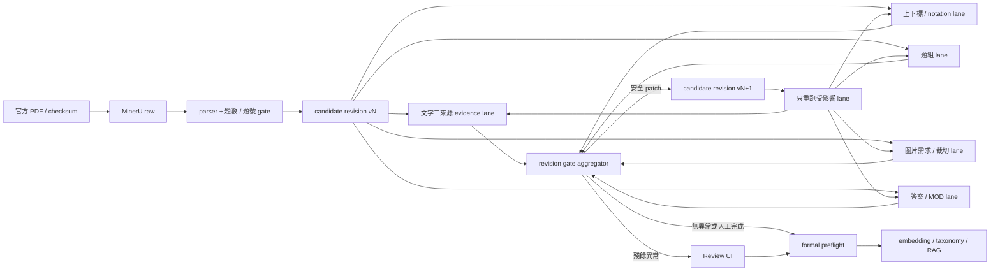

# 國考題審題流程：Dify／n8n 整合規格

更新日期：2026-08-22（Asia/Taipei）  
狀態：以目前 repository、SQL schema、Review UI、歷史 AI 產物與 AI395 新版審核構想為基準的整合規格。

AI395 模型路由、Docker staging、成本與 GPT-5.6 Luna 派工包另見 `docs/ai395-open-model-review-implementation-plan.md`；實際操作與逐關卡學習路徑見 `docs/ai395-review-workflow-operator-learning-guide.md`。

## 0. 核心結論

目前的正確資料順序是：

```text
官方 catalog / PDF
  → Q／ANS／MOD 配對
  → MinerU raw output
  → candidate JSONL + parse issue CSV
  → deterministic QA gate
  → PostgreSQL review staging
  → AI advisory
  → 人工題目／題組／圖片／答案審核
  → formal preflight
  → 正式題庫
```

候選題不是 AI 審核後才產生；候選題由 parser 從 MinerU 輸出產生。AI 只提供建議、疑點、路由與可驗證的修正草稿，不得自動寫入人工 `accept`、`block`、`exclude` 或 `reset_review`。

系統的權威層是 PostgreSQL；PDF、MinerU、candidate JSONL、AI 結果與人工事件各自保留，不互相覆寫。

## 1. 建議架構

```mermaid
flowchart LR
    A["官方 catalog / PDF"] --> B["Q / ANS / MOD 配對"]
    B --> C["MinerU OCR / layout / images"]
    C --> D["candidate JSONL + parse issue CSV"]
    D --> E["題號、題組、圖片、答案 deterministic gate"]
    E --> F["PostgreSQL review staging"]
    F --> G["建立 AI task / worklist"]
    G --> H["Python model workers / advisory lanes"]
    H --> I["validate + coverage proof"]
    I --> J["question_ai_review_events"]
    F --> K["Review UI 人工審核"]
    J --> K
    K --> L["question / group / visual / answer events"]
    L --> M["formal preflight + formal_sync_queue"]
    M --> N["正式 questions / answers / groups / assets"]
    O["n8n orchestrator"] -.排程、鎖、重試、通知、同步.-> A
    O -.執行 deterministic worker.-> C
    O -.呼叫 model worker / importer.-> H
```



### 元件責任

| 元件 | 責任 | 不應負責 |
|---|---|---|
| n8n | 排程、手動觸發、執行命令、鎖定、checkpoint、同步、重試、通知 | 重寫 parser、MinerU、SQL review 規則 |
| model adapter workers | 依 route registry 呼叫 Ollama Cloud、本地已認證模型或選配 provider，輸出 AI advisory | 下載 PDF、管理 checkpoint、直接決定人工狀態、直接 migration PostgreSQL |
| Dify（可選） | prompt 實驗、RAG 或人工可視化 | 保存權威狀態、成為模型路由唯一入口、直接寫 review events |
| Python scripts | PDF 配對、MinerU、parser、deterministic gate、匯入與驗證 | 取代人工決策 |
| PostgreSQL | review staging、目前狀態、append-only 事件、formal sync queue | 保存官方 PDF raw 檔案本身 |
| Review UI | 人工題目、題組、圖片、答案決策與修正 | 把 AI 建議當成人工決策 |

## 2. 既有程式與文件對照

### 2.1 總流程與 n8n 邊界

- `docs/moex-incremental-review-pipeline.md`
- `README.md`
- `docs/database-architecture.md`
- `docs/review-automation-strategy.md`

`scripts/run_moex_incremental_review_pipeline.py` 是 deterministic worker。n8n 只應呼叫它，不應把下載、MinerU 或 SQL 邏輯拆散重寫在 workflow node 內。

### 2.2 PDF、配對與 MinerU

- `scripts/build_pdf_asset_index.py`
- `scripts/build_question_answer_pairs.py`
- `scripts/run_mineru_pdf_batch.py`
- `scripts/run_moex_incremental_review_pipeline.py`
- `docs/remote-mineru-worker.md`

每一題的來源必須能追溯到 Q PDF 與主要答案來源。MOD／更正版本優先於 ANS；原始 PDF 與 MinerU output 不得被 parser 覆寫。

### 2.3 MinerU 到 candidate

- `scripts/build_question_candidates_from_mineru.py`
- `schemas/question_candidate.schema.json`
- `docs/parser-rule-inventory.md`
- `configs/text_normalization_rules.json`
- `docs/group-and-layout-ingestion-policy.md`

parser 會處理：

- 題號、選項、題幹與合併題切分
- 題組候選與 `group_ref`
- 圖片、表格、公式與相對路徑
- Q／ANS／MOD 對應與答案修正值
- OCR 正規化與 parser version
- `quality_status`：`pass`、`needs_review`、`blocked`
- `question_parse_issues` 與 document-level integrity issues

輸出至少包含：

```text
candidate_key
source_registry_key
question_number
stem / stem_markup / stem_image
options
answer / answer_payload
group_ref
image_refs
quality_status
issue_count
metadata
raw_block
```

### 2.4 Candidate 到 PostgreSQL

- `scripts/ingest_question_candidates_to_postgres.py`
- `scripts/ingest_indexes_to_postgres.py`
- `scripts/ingest_review_events_to_postgres.py`
- `docs/database-ingestion-preflight.md`
- `docs/sql-review-staging-preflight.md`
- `schemas/database/postgresql_schema.sql`

匯入模式支援 `merge` 與受控的 `replace-category`。正常增量流程使用 merge；若新 parser 改變已有人工作業的可審欄位，必須先產生 reviewed-candidate diff，不能直接覆蓋。

## 3. SQL 資料模型

### 3.1 Candidate 與問題

主要表：

- `exam.question_candidates`：目前 candidate projection、raw／normalized JSON、parser version、品質與 review status
- `exam.question_parse_issues`：parser 與 deterministic QA 問題
- `exam.question_review_events`：人工題目／題組／文字／圖片決策，append-only
- `exam.answer_review_events`：人工答案決策，append-only
- `exam.question_ai_review_events`：AI advisory，append-only
- `exam.model_runs`：模型、prompt、input／output、token、成本、request／response 的執行紀錄
- `exam.formal_sync_queue`：通過正式同步條件後的同步工作

### 3.2 人工事件

題目事件常見 action：

```text
accept, correct, needs_review, block, exclude,
unblock, comment, reviewed, unreviewed, reset_review
```

題組事件：

```text
confirm_group, confirm_not_group, reset_group_review
```

答案事件必須獨立保存。答案 `accept`／`unblock` 不能繞過題目未完成的人工審核；MOD 的空白或 `#` 異常也必須先進人工答案處理。

`reset_review` 只重新開啟決策，不刪除先前的人工修正、圖片資產或註記。較新的人工決策會壓過舊 AI 結果，但舊 AI 事件仍保留作為歷史證據。

### 3.3 正式入庫條件

至少需要：

1. candidate 通過 parser／asset／group deterministic gate。
2. 最新題目人工狀態為 `accept` 或 `unblock`。
3. 最新答案人工狀態為 `accept` 或 `unblock`。
4. 正式題目、答案、題組與必要圖片資料均存在。
5. 沒有未處理的 blocker 或不允許的解析殘留。

`quality_status=pass` 或 AI `status=pass` 都不等於正式接受。

## 4. AI 審核規格

### 4.1 現行四種 lane

每個 candidate 一次只進一個主要 residual lane：

| lane | 負責範圍 | 不負責 |
|---|---|---|
| `ocr_text` | 可觀察的 OCR 字形、符號、繁簡、標點與格式 | 解題、答案判斷 |
| `semantic_transcription` | OCR 造成的明顯語意破壞 | 自行改寫官方原文、解題 |
| `group` | 題組範圍、共同題幹、承上題路由 | 批准題組 |
| `visual` | 圖片／表格／公式依賴與視覺檢查路由 | 文字模型假裝看圖、直接寫人工 visual decision |

來源規則：

- `docs/skills/national-exam-ai-audit/prompts/`
- `docs/skills/national-exam-ai-audit/profiles/`
- `docs/skills/national-exam-ai-audit/rules/`
- `docs/skills/national-exam-ai-audit/references/core-rules.md`
- `docs/skills/national-exam-ai-audit/references/issue-taxonomy.md`
- `docs/skills/national-exam-ai-audit/references/output-schema.md`

### 4.2 AI task 輸入

目前 v4 task 至少要有：

```text
candidate_key
stage: question | group | image | answer
lane
content.stem
content.options
content.group_ref
content.image_refs
exam.category / subject / year / question_number
neighbors
signals
sources
source_fingerprint
```

可附帶 raw block、parser issues、前後題、最新人工狀態、最新 AI 結果、PDF／MinerU 路徑與圖片 metadata，但不能把未必要的整份資料庫或所有 rule registry 塞進 prompt。

### 4.3 AI task 輸出

現行 sparse batch contract：

```text
batch_id
checked_count
issues[]
model
prompt_version = national_exam_sparse_audit_v4
```

每個 issue 至少包含：

```text
candidate_key
field
before
after
issue_family
source_class
route
confidence
note
rule_id（deterministic route 時必須有）
```

允許的 issue family 包含：

```text
non_question_header, boundary_merge, boundary_missing,
empty_stem, option_structure, ocr_character, notation_markup,
semantic_disfluency, semantic_ocr, visual_dependency, group_dependency
```

允許的 route 包含：

```text
none, deterministic, propose_rule, human_text, human_pdf,
parser, group, visual
```

安全規則：

- 正常題目可以不輸出 issue，但 `checked_count` 與 coverage proof 必須證明已檢查。
- AI 不得輸出或寫入人工 `accept`、`block`、`exclude`、`reset_review`。
- AI 不得解題或擅自改答案；答案問題只能走 answer review。
- `group`、`visual`、`answer` 問題不可混成 question text 修正。
- 只有 active deterministic rule 且 exact match 時，才可由腳本 materialize；其他都只能是建議。
- Dify 產出的 JSON 必須先經 schema、candidate key、source fingerprint、coverage 與 human-unreviewed gate 驗證。

## 5. Dify workflow（選配）

Dify 不是第一版跑通的必要元件。若後續啟用，只處理已進入 PostgreSQL review staging 的 candidate，不直接管理 PDF 或 MinerU，也必須使用與 Python model worker 相同的 `route_key` 與 task/result contract。

建議節點：

1. Webhook／HTTP 接收 n8n 傳入的 task batch。
2. 依 `lane` 載入對應 prompt、subject rule 與必要 source context。
3. 以 structured JSON 輸出 sparse result。
4. 回傳 `batch_id`、`checked_count`、issues、model、prompt_version。
5. n8n 收到結果後執行 repository validator。
6. 驗證成功才呼叫 advisory importer。

Dify 不應直接把結果寫入 `question_review_events` 或改動 `review_status`。若使用 Dify 內建知識庫，知識庫只能作為輔助檢索；candidate、人工狀態與事件仍以 PostgreSQL 為準。

## 6. n8n workflow 建議

### 6.1 主流程

1. `Schedule Trigger` 或 `Manual Trigger`。
2. 檢查 production execution lock，確保同一時間只有一個 worker。
3. `Execute Command`：

   ```bash
   python3 scripts/run_moex_incremental_review_pipeline.py \
     --workers 2 \
     --no-start-review-ui \
     --review-ui-url "$REVIEW_PRIMARY_UI_URL"
   ```

4. 讀取 run state，建立精準同步 bundle：

   ```bash
   python3 scripts/prepare_review_host_sync_bundle.py
   ```

5. 依 manifest 同步 PDF／MinerU／candidate／index 產物。
6. 執行 `ingest_indexes_to_postgres.py` 與 `ingest_question_candidates_to_postgres.py --sync-mode merge`。
7. 從 SQL 建立 AI worklist，匯出 v4 task packets。
8. 將 `route_key` 與 immutable packet 交給 Python model adapter worker；若特定實驗啟用 Dify，也走同一 contract。保存 `batch_id`、execution id、provider、model、prompt version 與 effective config hash。
9. 執行 `validate_sparse_results.py`、coverage proof 與 reviewed-candidate gate。
10. 通過後執行 `import_advisory_results.py` 或既有 AI importer，寫入 `exam.question_ai_review_events`。
11. 查詢 SQL／Review UI 數量與錯誤，寫入 sync state。
12. 成功或失敗通知；失敗從既有 bundle 重新執行，不重新猜測 catalog 差異。

### 6.2 n8n 必須保存的 execution metadata

```text
run_id
sync_id
batch_id
candidate_key 範圍或 manifest hash
source_fingerprint
provider / model
prompt_version
input_hash
validator result
import result
開始／結束時間
exit code
錯誤訊息
```

環境變數與 credential 使用：

```text
TW_EXAM_REPO
ASSET_ROOT
MINERU_BIN
REVIEW_PRIMARY_UI_URL
REVIEW_PRIMARY_DB_HOST
REVIEW_PRIMARY_DB_PORT
REVIEW_PRIMARY_PROJECT_ROOT
```

資料庫密碼、SSH key 與 owner token 不得寫在 workflow JSON 或 Git。

## 7. Retry、checkpoint 與安全 gate

- catalog scan-only 不更新 checkpoint。
- 只有 PDF、MinerU、candidate、SQL 匯入都成功才更新 checkpoint。
- 已存在且 checksum 相同的 PDF／MinerU 結果可跳過。
- candidate 使用 merge upsert；不要用無條件 replace 覆蓋歷史 staging。
- reviewed candidate 的 stem、選項、答案、題組、圖片或品質欄位改變時，必須停止並產生 diff 報告。
- 只有人工批准後，才可追加 `reset_review` 或 `reset_group_review`。
- AI 結果驗證失敗時，不得部分匯入為完成；需以 batch／segment 為單位重跑。
- 任何 AI provider timeout、quota 或 JSON 截斷，都應標記該 segment 未完成。
- production 只允許一個 Review UI writer；fallback PostgreSQL 不得接受自動 review writes。

## 8. 人工 Review UI 對接

若沿用現有 Review UI，n8n／Dify 不需重新實作人工審核，只需：

1. 將 candidate 與 AI advisory 正確匯入 SQL。
2. 讓 UI 依 latest human state、effective correction 與 AI freshness 顯示 queue。
3. 人工操作由既有 API／UI 寫入 append-only events。
4. AI 建議可顯示為一鍵修正草稿，但按下後仍保存為人工事件，不能把 AI event 改寫成人工事件。
5. 題目與答案分開審核；題組與圖片也有各自 owner stage。

主要行為文件：

- `docs/skills/national-exam-ai-audit/references/database-ui-runbook.md`
- `docs/skills/national-exam-ai-audit/references/review-ui-global-behavior.md`
- `docs/skills/national-exam-ai-audit/references/ui-ownership.md`
- `docs/visual-ai-audit-workflow.md`

## 9. 歷史 AI 資料與重建方式

歷史產物位於本機非 Git 資料根，主要目錄為：

```text
國考題資料夾/30_normalized_items/question_candidates/ai_audit_runs
國考題資料夾/30_normalized_items/question_candidates/codex_audit_tasks
國考題資料夾/30_normalized_items/question_candidates/chatgpt_mcp_audit_tasks
國考題資料夾/30_normalized_items/question_candidates/subject_codex_audit_tasks
國考題資料夾/30_normalized_items/visual_ai_audit_tasks
```

目前 active run 的主要歷史檔案：

```text
question_ai_review_events.jsonl
question_review_events.jsonl
answer_review_events.jsonl
```

重建過去 AI 行為時，依下列關聯鍵合併：

```text
candidate_key
input_hash
prompt_version
model / provider
source_fingerprint
created_at
```

歷史資料通常可取得 per-candidate 的 status、findings、evidence、reason、suggested correction 與 recommended action；但不是每一輪都保留完整原始 provider request／response、token、成本、延遲或模型內部推理。因此未來 Dify／n8n 應強制寫入 `exam.model_runs`，不要只保存最後摘要。

## 10. 實作分階段

### Phase 1：不改人工流程

- n8n 只包裝既有 deterministic pipeline。
- Dify 只做一個 lane 的 advisory。
- 結果只寫 `question_ai_review_events`。
- 人工仍在現有 Review UI 完成。

### Phase 2：完整 AI coverage

- 由 SQL worklist 分配 lane。
- 每個 batch 使用 immutable task packet。
- 驗證 candidate key、source fingerprint、checked count 與零遺漏。
- 導入 AI feedback／learning，但不自動升級規則。

### Phase 3：正式同步

- 通過人工題目與答案 gate。
- 執行 formal preflight。
- 將 approved rows 放入 `formal_sync_queue`。
- 由正式同步 worker 寫入 questions、answers、groups、assets。

## 11. 驗證命令索引

```bash
python3 scripts/validate_agent_governance.py
python3 -m unittest discover -s tests
python3 -m py_compile scripts/serve_question_review_ui.py scripts/build_question_candidates_from_mineru.py
python3 scripts/run_moex_incremental_review_pipeline.py --scan-only
```

AI v4 相關驗證與匯入腳本位於：

```text
docs/skills/national-exam-ai-audit/scripts/
```

## 12. 最小可行落地原則

第一版不要把整個 repository 重寫成 Dify workflow。保留既有 Python parser、MinerU worker、PostgreSQL schema 與 Review UI，讓：

```text
n8n = orchestration
Dify = AI advisory
PostgreSQL = source of truth
Review UI = human decision
Python scripts = deterministic data plane
```

這樣可以保留既有的 checksum、checkpoint、append-only review history、reset safety、AI advisory 邊界與正式入庫 gate。

## 13. AI395 新版目標架構

新版流程不應是每題從頭走到底的單一路徑，而應分成三個區域：

1. 不可變來源區：官方 catalog、Q／ANS／MOD PDF、checksum、MinerU raw output。
2. 可重建審核區：candidate revision、文字／符號／題組／圖片／答案 lane、AI advisory、修正 proposal。
3. 正式與應用區：人工決策、formal tables、embedding、分類、RAG 與詳解。



這個設計保留並行能力，但所有 lane 都必須讀取同一個 immutable `revision_id`。任何修正都建立新 revision，不直接覆寫原始 MinerU 或舊 revision。

## 14. 控制面選擇

### 14.1 建議組合

建議第一版採：

```text
n8n                   = 排程、粗粒度 DAG、警報與人工啟動
PostgreSQL job tables = 狀態、租約、重試、去重與進度
Python workers        = MinerU、parser、PDF evidence、裁切、validator、importer
模型服務              = OpenAI-compatible text / vision endpoint
Dify                   = 可選的 prompt 實驗、RAG 或人工可視化，不是資料真相
Review UI              = 人工決策與 evidence 驗收
```

n8n 不應為十幾萬題建立十幾萬個長生命週期 node execution。它只應啟動一個 run、建立 batch、監控 queue 與通知；逐題／逐 batch 的可靠狀態放在 PostgreSQL，由 Python worker 以 lease 取得工作。

Dify 可在早期協助調 prompt 或做 RAG，但 production lane 必須遵守相同 task/result JSON contract，因此之後可無痛換成 vLLM、SGLang、Ollama、遠端 API 或其他執行器。

第一個可執行版本先以隔離 Docker Compose staging 跑通 n8n、測試 PostgreSQL、Python workers、mock model 與 formal dry-run。官方資料 snapshot 只讀掛載，staging 有獨立 volume／credential／port，不能掛 production PostgreSQL volume。MinerU 與本地模型可用獨立 GPU Compose profile；未完成資源共存測試前由 lease 保證互斥。production container 化或 migration 仍是另一個需要 exact G3 approval 的部署步驟。

### 14.2 AI395 資源分流

AI395 同時承擔 production PostgreSQL、Review UI、MinerU、外接模型 worker，並預留本地 Qwen 3.8-27B 的選配測試。工作 queue 必須標示 resource class：

```text
cpu_io
gpu_mineru
external_text_llm
external_vision_llm
local_llm_gpu
db_validate
db_apply
```

`gpu_mineru` 與 `local_llm_gpu` 預設互斥；只有設備 benchmark 證明共存安全才允許有限並行。外部模型 lane 則依 provider concurrency、subscription usage、timeout 與 budget guard 控制。模型 worker 只讀 production snapshot、寫 artifact outbox，不持有 production owner／人工事件寫入權。

### 14.3 可調模型節點

n8n node 不保存實際 model id，只保存 lane／`route_key`。Python resolver 從版本化的 provider、route、resource、budget、schedule 與 model profile 設定決定實際 provider。初始狀態為：

```text
ollama_cloud.enabled = true
local_qwen.enabled = false
local_qwen_mlx.enabled = false
opencode_go.enabled = false
```

owner 日後調整某一關的 primary、challenger、fallback、batch size、timeout 或 sampling，只改經 schema 驗證的設定檔，不改 n8n DAG。每次執行保存 effective config 與 SHA；disabled、uncertified 或能力不符的 profile 必須 fail closed。完整檔案與解析優先序見 `docs/ai395-open-model-review-implementation-plan.md` 第 4.2 節。

### 14.4 MacBook MLX／Tailscale provider contract

MacBook 的 `qwen3.8-27b-mlx` 是可拔除的測試算力，不是 n8n 的特殊 node。n8n 只傳 lane／`route_key`，由 provider resolver 讀取：

```text
provider_id = local_qwen_mlx
profile_id  = qwen3.8-27b-mlx-tailscale
endpoint    = QWEN_MLX_BASE_URL
model       = QWEN_MLX_MODEL
enabled     = provider_registry.local_qwen_mlx.enabled
```

初始 contract：

- `QWEN_MLX_BASE_URL` 只能是 `https://<machine>.<tailnet>.ts.net/v1`；同機 probe 才能用 `http://127.0.0.1:11434/v1`。
- transport 使用 Ollama 的 OpenAI-compatible `/v1/models` 與 `/v1/chat/completions`；API key 使用非秘密的 `ollama` placeholder，網路邊界由 Tailscale ACL／Serve 提供。
- `local_qwen_mlx` 預設 disabled、只允許 `shadow`／`test`，未認證不得進 primary／outage fallback，也不能 materialize AI proposal。
- 首次執行先做 read-only model list probe；live text／vision probe 必須由 owner 明確加 `--live`，結果進 provider certification evidence，不進人工 review events。
- 不直通 11434、不用 public Funnel、不把 Tailscale auth key 放在 n8n credential export；該 Serve endpoint 是通用 tailnet Ollama 入口，消費者由 Tailscale ACL 控制，不綁定單一 AI395；AI395 與 MacBook 不可因 provider 暫時離線而阻塞 deterministic lanes。

實作檔案：`scripts/probe_qwen_mlx_tailscale.py`、`scripts/setup_qwen_mlx_tailscale_serve.sh`、`configs/ai395_review_pipeline/provider_registry.yaml`、`docs/skills/national-exam-ai-audit/profiles/qwen3.8-27b-mlx-tailscale.yaml`。Docker staging 只注入 endpoint／model 環境變數，並維持 `QWEN_MLX_ENABLED=0` 直到設備認證完成。

## 15. Revision 與有限重跑模型

### 15.1 建議新增的邏輯實體

以下為 schema 設計草案，尚未授權套用 production：

| 實體 | 用途 |
|---|---|
| `pipeline_runs` | 一次 catalog／歷史批次的範圍、程式 SHA、設定與總進度 |
| `pipeline_jobs` | batch 工作、resource class、lease、attempt、checkpoint、錯誤 |
| `question_revisions` | 每次有效 candidate 內容的 immutable snapshot 與 parent revision |
| `review_lane_runs` | 每個 revision 各 lane 的模型／規則／prompt／結果與狀態 |
| `review_findings` | 可查詢的 issue、evidence、owner stage、severity |
| `correction_proposals` | before／after、來源證據、是否可自動 materialize、決策 |
| `model_profiles` | provider、model revision、capability、runtime、quantization、sampling |

每個 revision 至少保存：

```text
candidate_key
revision_id
parent_revision_id
content_hash
source_pdf_sha256
parser_version
created_at
created_by_kind: parser | deterministic_rule | ai_proposal | human
caused_by_run_id / caused_by_proposal_id
changed_fields[]
```

`created_at` 只用於稽核。防止無限迴圈必須使用 `content_hash`、因果 revision 與欄位依賴，不可只依靠「AI 上次修改時間」。

### 15.2 欄位失效矩陣

| 變更內容 | 必須重跑 | 不必重跑 |
|---|---|---|
| source PDF／checksum 改變 | 全部 lane | 無 |
| 題號、切題邊界、選項邊界 | 文字、notation、題組、視覺、答案 alignment | 無 |
| 題幹／選項文字 | 文字、notation、題組 cue、視覺 cue | 答案值本身；除非題號／邊界也變 |
| `stem_markup`／option markup | notation 與顯示 regression | 題組、答案 |
| `group_ref`／group range | 題組、formal group projection | 文字、notation、答案 |
| image refs／人工補圖／crop | 視覺與需要圖片的應用索引 | 純文字、答案 |
| answer payload／MOD policy | 答案、詳解與答案相依應用 | 題目文字、題組、圖片 |

### 15.3 防迴圈規則

- 同一 `(candidate_key, revision_id, lane, model_profile, prompt_version)` 只能有一個有效完成結果。
- proposed patch 產生相同 `content_hash` 時視為 no-op，不建立新 revision。
- 若偵測到 A→B→A 或相同 patch 重複提出，標記 `oscillation_detected` 並送人工。
- 建議每個 lane 對同一 source revision 最多自動 materialize 2 次；第 3 次直接人工。
- 只允許 active deterministic rule 或通過 evidence policy 的 exact patch 自動 materialize。
- 新 revision 只讓失效矩陣列出的 lane 變成 stale，其他 lane 結果可沿用。

## 16. 三來源證據與文字自動修正

### 16.1 現有能力

現有 `scripts/build_pdf_reference_source.py` 已會保存：

- Poppler `pdftotext -layout`／`-raw`
- pypdf
- pdfplumber
- PDF SHA-256、頁碼、flags、page PNG

`scripts/build_three_source_audit_pilot.py` 會把 MinerU／parser candidate、官方 PDF 多引擎文字、頁面視覺 crop 與目前／舊圖片資產組成 blind packet。

三個 Python extractor 不是三份獨立真相；它們可能共同讀到同一個錯誤或隱藏 PDF text layer。因此必須按 extractor family 去重，且涉及中文字形、上下標、公式或版面時，rendered PDF pixels 才是最終來源證據。

### 16.2 建議 evidence 等級

| 等級 | 條件 | 處理 |
|---|---|---|
| E0 | active exact deterministic rule，唯一局部 match，regression 通過 | 可自動建立 revision |
| E1 | 至少兩個獨立 PDF extractor family 對局部 before／after 一致；像素也支持 glyph／notation | shadow 通過後可自動建立 revision |
| E2 | extractor 一致但像素無法確認，或 LLM 只從語意推測 | 只建立 proposal，人工核對 PDF |
| E3 | 官方 PDF 本身可能是簡體、異體字或原始錯字 | 保留官方原文，不自動「美化」 |

簡繁轉換不得用全域 OpenCC 或模型偏好直接改。只有官方 PDF 像素與局部文字證據都支持確切替換時，才可修正 MinerU／parser transcription；若官方來源本身使用該字形，應原樣保留。

### 16.3 格式與切題

先用 deterministic invariants：

- 題數與官方答案題號一致
- 題號從 1 開始且密度足夠
- 無重複／缺號／越界
- 選項 label 唯一且順序正確
- 下一題 marker、頁面位置與 answer alignment 一致

只有邊界仍衝突時才交給 LLM 比對鄰題與 PDF evidence。LLM 不得用解題內容猜測題目邊界。

## 17. 上下標與科學符號

上下標不應設計成 LLM-first。現有 parser 已有 `normalize_science_markup()`、`markup_payload()`、`MARKUP_HINT_RE`，並包含藥動學、血液學、化學與商標符號等一批確定 token 規則。

建議分三層：

1. deterministic normalization：LaTeX／Unicode／MinerU 變體轉成 canonical markup。
2. source verification：用 PDF text families 與 rendered pixels 確認顯示語意。
3. residual LLM：只找規則未涵蓋的疑似 notation，不直接改；輸出 exact span、預期 markup、PDF 頁碼與信心。

正式內容同時保存：

```text
plain_text
display_markup_json
source_raw_text
normalization_rule_id
source_evidence
```

規則只能以「特定 token＋左右 anchor＋科目範圍」升級，不能把模型曾看過的專業名詞直接加入全域 replacement。

## 18. 題組 lane

建議流程：

1. Python 先找明確範圍、共同題幹、`承上題`／`前述`／`依下列資料` 等 marker。
2. 由 deterministic 邏輯建立 group proposal 與負控制，避免單一關鍵字誤判。
3. LLM 只看相鄰題、共同題幹與 marker，輸出起訖題號、順序、shared stem 與 confidence。
4. 初期所有 proposal 仍由人工確認。
5. 累積 gold cases 後，以「特定 marker rule」為單位升級自動化，不以整個模型為單位放寬。

在目前治理下，AI／規則不能冒充人工寫入 `confirm_group`。若未來要讓 verified rule 直接進 formal gate，必須新增獨立的 `machine_verified_group` 狀態並經 governance、schema 與 CODEOWNERS 審核；不能把它偽裝成人工事件。

## 19. 圖片與自動裁切 lane

### 19.1 三階段判斷

1. `need_visual`：題目是否真的依賴圖片／表格／公式版面。
2. `asset_quality`：現有 MinerU 或人工資產是否屬於正確題目、範圍是否完整。
3. `crop_proposal`：若缺圖或錯圖，定位官方 PDF 頁面與 bbox，產生新 asset proposal。

第一階段必須先消除既有 false positive，例如一般文字中的影像名詞、英文 `tablet`／`stable` 等，不因弱關鍵字就送人工。

### 19.2 裁切策略

視覺模型的 bbox 只當 rough proposal，不能直接作正式裁切。建議：

1. PDF 先轉成固定 DPI 頁面圖。
2. 以題號／相鄰題號定位 question region。
3. 視覺模型標出粗略目標或判斷圖表類型。
4. Python 依 PDF layout object、connected component、白邊與題目區域 snap bbox。
5. 產生 before／after contact sheet、原頁 overlay 與資產 hash。
6. 人工接受後才把新 asset 綁定 candidate revision。

crop proposal 至少保存：

```text
candidate_key
revision_id
source_pdf_sha256
page_number
coordinate_space
page_width / page_height
bbox: x0, y0, x1, y1
dpi
asset_role
crop_sha256
model_profile / prompt_version
before_asset_refs
overlay_path / before_after_contact_sheet
```

### 19.3 人工三類驗收

既有三個人工結果可直接沿用：

| 人工結果 | 意義 | UI 必須顯示 |
|---|---|---|
| `no_visual_required` | 原本誤判有圖，實際不需要 | 題文、AI 理由、官方頁面 |
| `visual_asset_ok` | MinerU／既有圖片正確 | 原圖、綁定位置、PDF 對照 |
| `visual_asset_problem` | 缺圖、錯圖、裁切或綁定錯誤 | before、proposal after、bbox overlay、接受／拒絕 |

當人工接受 corrected crop 後再建立新 revision，視覺 lane 重新驗證一次。只有同一裁切策略累積足夠 gold cases、critical false negative 為 0，才可逐步將低風險 crop 改成抽樣人工。

## 20. 答案與 MOD lane

### 20.1 可 deterministic 處理

- Q／ANS／MOD 文件配對與 checksum 正確。
- 答案題號集合完整、從 1 開始且密度足夠。
- 每題答案為單一合法選項，ANS／MOD 沒有衝突。
- MOD 優先於 ANS，且 parser 已能把 `#` correction 轉成 `accepted_values`。

上述只能形成 `machine_verified_answer` evidence。在目前正式 gate 下，仍需人工 answer event；可先用 Review UI 做按考卷 batch accept，不能由 AI 偽造人工接受。

### 20.2 特殊答案

遇到 `#`、空白、送分、多答案、題號錯位或 ANS／MOD 衝突時，建立特殊答案 task，輸入：

- MinerU 答案 markdown
- PDF extractor family 原文
- 官方答案頁 crop
- 題號集合與附近 footnote／更正文字
- question／answer source hash

輸出應為結構化：

```text
answer_kind: single | multiple | all_credit | void | unresolved
accepted_values[]
source_page
source_spans[]
visual_evidence
confidence
recommended_route
```

LLM 只解讀官方答案文件，不重新解題。文字來源衝突時再使用 vision；仍無法確定則送人工答案 queue。

## 21. 模型策略與候選者

模型不寫死在 workflow；每次執行以 `model_profile_id` 指定 weights revision、runtime、quantization、capability、context、sampling 與 prompt version。

審題 runtime 只用開源／開放權重模型，初始路由如下：

- Ollama Cloud 是主池：DeepSeek V4 Flash 負責文字 residual；Gemma 4 31B 負責主要 vision；Kimi K2.7 Code 負責高難度圖片／裁切／答案影像與 Gemma 衝突複核；Qwen 3.5 與 Mistral Large 3 作分層抽樣／negative control。Kimi 官方標示為 `high` usage，因此不對全量圖片常態呼叫。
- AI395 local `Qwen/Qwen3.8-27B` 是預設停用的候選：設備通過 text、vision、JSON、效能、OOM 與 MinerU 資源共存認證後，先進 shadow challenger，不立即取代 cloud primary。
- OpenCode Go 是預設停用的選配 provider：不需先訂閱；只有 Ollama Cloud corpus pilot 顯示額度／可用率不足時，再由 owner 決定訂閱並啟用 DeepSeek V4 Flash／GLM 5.2 profile。
- GPT-5.6 Luna 只作工程實作代理，不進 production 審題 allowlist。
- Kimi K2.7 Code 採 Modified MIT，profile 必須保存條款確認；MiniMax M3、Kimi K3 與 OpenCode Qwen Max／Plus SKU 也必須先通過各自 upstream model 與商用 license mapping。
- MinerU、Jina embedding 與 reranker 可留在 AI395 本機；Jina 權重若用於商業 production，仍需先完成 CC BY-NC 授權判定。

完整模型 CP、訂閱容量、adapter、certification、lineage 與派工規格見 `docs/ai395-open-model-review-implementation-plan.md`。

建議先以 200 題／lane 的 stratified pilot 比較模型，再跑至少 1,000 題 shadow。自動化升級以 rule family／crop strategy 為單位，建議初始門檻為：JSON contract 100%、零漏題、零 source-fidelity violation、auto-patch precision 至少 99.5%，並保留 1%～5% 隨機抽樣。

## 22. Review UI v2

新版 UI 的主要單位應從「按順序翻所有題」改為「處理 disjoint exception queues」。

### 22.1 桌面 queues

- source／題數／切題 blocker
- 文字三來源衝突
- 上下標／notation proposal
- 題組 range proposal
- 圖片誤判、正確圖、錯圖 crop proposal
- 特殊 MOD／多答案／送分
- correction oscillation／超過重跑上限
- machine-pass 隨機抽樣
- formal preflight drift

每題顯示 revision diff、PDF 頁、三來源 evidence、模型／prompt／rule、before／after、是否會讓哪些 lane stale。

### 22.2 手機介面

手機只處理適合快速決策的 queue：

- 接受 proposal
- 拒絕並選 structured reason
- 標記需桌面看 PDF／圖片
- 跳過不寫事件

圖片 crop、複雜題組與 MOD evidence 可以在手機看摘要，但需要精確座標或文字修改時導回桌面。批次接受只能針對同一 rule id／相同 patch signature 且 evidence 完整的群組。

人工回饋應保存 issue family、錯誤原因、正確處理、model profile、prompt version、rule id 與 revision，而不是只留下自由文字。

## 23. 十幾萬題的兩週推進條件

兩週應是「工作流已穩定後的 corpus run」，不是同時開發工作流、換 production schema、重新審完所有題與正式發布。

若範圍為 120,000 題，平均需處理約 8,572 題／日；180,000 題則約 12,858 題／日。這不可能依靠逐題 LLM＋逐題人工完成，必須：

1. 已人工接受且 source/content hash 未改變者直接 carry forward，不重審。
2. deterministic gate 先處理絕大多數正常題。
3. LLM 只審 residual 或以 sparse batch 檢查，不為每個正常題生成長篇 pass。
4. 人工只看異常與抽樣；若人工 queue 超過總題數 2%～3%，需先改善規則，不應硬推。
5. 每日量測 ingestion、MinerU、parser pass、lane residual、AI throughput、human queue、formal-ready 與 failure rate。

建議 corpus run：

| 日程 | 工作 |
|---|---|
| Day 0～2 | freeze scope、SQL inventory、source／content hash、排除已正式且無 drift 題目 |
| Day 3～4 | deterministic parser、題數、三來源與 notation 全量 dry-run |
| Day 5～6 | text／group／visual／answer stratified pilot，確認 AI395 資源與模型 profile |
| Day 7～10 | 全量 deterministic＋residual AI shadow；只產 artifacts／advisory |
| Day 11～12 | Review UI exception queues、rule-family batch review、隨機抽樣 |
| Day 13 | formal dry-run、完整 diff、資產／題組／答案與 idempotency 驗證 |
| Day 14 | 取得 exact production apply approval 後受控發布、smoke test、保留 rollback evidence |

目前治理仍要求正式題目與答案的人類決策。若希望 machine-verified 題目不經逐題人工直接 formalize，必須先由 owner 明確決定新的治理與 SQL 狀態模型，經 CODEOWNERS review；在此之前可用 machine verification＋人工 batch approval 降低負擔，但不能把 AI 結果冒充人工事件。

## 24. Embedding、分類與應用層

只有 formal accepted 且穩定 revision 可進應用層。

### 24.1 Embedding

- 每筆 embedding 綁定 `question_id`、`input_hash`、model revision、text scope 與 taxonomy filter。
- 題目 revision 改變時只讓相同 scope 的 embedding stale。
- 使用 metadata filter＋BM25／trigram＋dense embedding＋reranker 的 hybrid retrieval。
- 先建立 100～1,000 題人工 retrieval benchmark，再決定模型；不要只看通用 leaderboard。
- 搜尋錯誤回饋進 retrieval evaluation／hard-negative set，不直接改題目內容。

### 24.2 課程分類與關鍵字

repository 已有 `docs/skills/classify-exam-curriculum/` 雛形，要求：

- 只分類 formal accepted 題目。
- taxonomy 有 version，不覆寫舊分類歷史。
- teacher／admin 關鍵字存 SQL 關聯表，可直接 filter，不需每次向量搜尋。
- AI 分類是 advisory；低信心、跨領域與未知 label 進人工。

### 24.3 RAG、詳解與自動出題

題目原文、官方答案、課本／文獻 evidence、AI 詳解與生成題必須分表與分版本保存。詳解至少帶 citation、source span、model run、answer consistency 與 review status；自動生成題在進學生系統前另走獨立品質與相似度 gate，不能回寫官方題目 revision。

## 25. 建議第一個實作切片

先完成「文字三來源 evidence lane」，因為現有程式最接近可用，風險也低於圖片自動裁切：

1. 從 AI395 production 建立 read-only、immutable 的 200 題 stratified snapshot。
2. 以 `build_pdf_reference_source.py` 與 `build_three_source_audit_pilot.py` 產生 evidence packets。
3. 定義 text finding／correction proposal JSON contract 與 source-family gate。
4. 不使用 LLM，先量出完全一致、extractor 衝突、像素必看三種比例。
5. 先讓 Ollama Cloud DeepSeek V4 Flash／Gemma 4 31B 只處理 residual，做盲測；圖片 lane 再以同一批 pixel packets 讓 Kimi K2.7 Code 對高難度／低信心／衝突子集作 challenger，比較 fidelity、critical false negative、bbox、JSON、延遲與 weighted usage。本地 Qwen 3.8-27B 完成設備認證後，用相同 packets 加入獨立 challenger shadow。
6. validator 產出 precision、false negative、source-fidelity violation、wall time 與記憶體報告。
7. 全程只寫 staging artifacts；通過 owner review 後，再提出 schema migration 與 production importer PR。

這個切片完成後，同一套 revision／lane／evidence contract 可直接複用到 notation、group、visual 與 answer，而不必先決定最終是否使用 Dify。

在這個切片之前，Luna 先交付 20 題 Docker staging walking skeleton：用 mock model 將 catalog fixture、MinerU/parser fixture、隔離 SQL、五 lane fan-out、revision aggregator、人工 exception 與 formal dry-run 全部跑通。這確保後續是逐 node 替換 stub，而不是各 lane 完成後才第一次整合；操作順序見 `docs/ai395-review-workflow-operator-learning-guide.md`。
