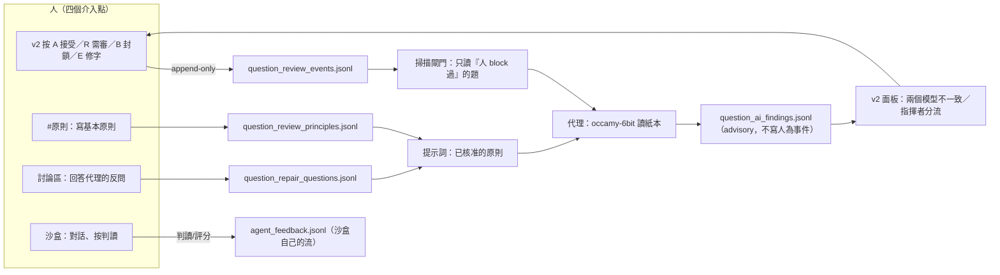

# 修理代理的進度面（掃描 → 讀紙本 → 指揮者分流）

這份講的是**代理在做什麼、做到哪裡、以及這件事在哪裡發生**。
操作程序（拉紀錄、建規則、重掃）在
[`run-question-review-loop`](../run-question-review-loop/SKILL.md)；
部署本身在 [`deploy-qbr-review`](../deploy-qbr-review/SKILL.md)。

## 人去哪裡審題、哪裡跟代理合作（一張圖；2026-09-29 全部量過）

先講結論：**審題的主場是常駐機的 `/v2`；跟代理對話、試它讀得好不好是筆電沙盒；兩邊讀的是不同份資料。**

| 面 | 位址 | 誰在用 | 讀什麼 | 寫什麼 |
|---|---|---|---|---|
| **站上審題介面 v2** | `http://192.168.10.70:8765/v2`（量到 200） | **人（你）** | `~/qbr-review/queue/review-ui/candidates.jsonl`（199 MB／79,090 題）、`question_ai_findings.jsonl`（707 MB，代理的判讀） | `question_review_events.jsonl`（**人為裁決，append-only**）、`question_review_principles.jsonl`（基本原則）、`question_repair_questions.jsonl`（你對代理反問的回答） |
| **常駐機佇列目錄** | `192.168.10.70:~/qbr-review/queue/review-ui/` | 站上所有程式 | — | 代理的 `question_ai_findings.jsonl`（**mtime 停在 Sep 25 22:30：站上代理迴圈沒在跑**）、`crops/`（860 張） |
| **筆電沙盒（代理工作台）** | `http://192.168.20.249:8790`（LAN）／`http://100.96.207.80:8790`（Tailscale）；`repair_agent_test/agent/ui/server.py`，PID **75668**（2026-09-29 換版重啟） | 人（試代理） | **筆電快照**：`qbr/data/review-queues/live/review-ui/`（candidates／events／findings／questions／principles） | 沙盒自己的流：`repair_agent_test/agent/store/agent_feedback.jsonl`（`action: ai_feedback`、`source: agent`／`designer`、`engine: occamy-6bit`）；每輪經驗 `store/lessons.jsonl` |
| **沙盒的列表狀態** | 同一頁的「人的狀態」下拉 ＋ 每列三個 chip | 人（你） | `human_status`＝**站上 v2 的裁決**（摺 `question_review_events.jsonl`：accept／block／needs_review／reset_review…）；`judged_by_designer`＝你在沙盒按的；`judged_by_agent`＝代理自己判的 | 只讀（篩選走 `?status=`，同一個 `bridge.do_browse`，CLI／UI／代理看到同一份） |
| **代理本體** | Pi SDK session，腦＝`occamy-6bit`（`127.0.0.1:18130`），工具＝`read_page` 等（`repair_agent_test/agent/lib/tools.mjs`） | 代理 | 佇列＋PDF（自己切圖） | 自己的 findings／判讀（**不寫**人為事件） |
| **稽核迴圈** | LaunchAgent `com.qbr.audit-pharmacist1`（PID 37888）→ `repair_agent_test/agent/audit_pharmacist1.sh` | 代理 | 藥師(一) 99 題（帳本 `/tmp/agent_perf/audit/summary.tsv`） | `store/agent_feedback.jsonl`（28 列） |



**「訓練小模型」現在不是這張圖的一部分（誠實版）。** 目前沒有任何微調管線、沒有資料集、沒有權重更新：
模型（occamy-6bit）**只被提示詞改變**——你的**基本原則**、你對反問的**回答**、題目的**人為註解**，
加上掃描閘門（只讀人 `block` 過的題）與代理自己寫的經驗（`learned`）。你的 20,329 筆人為事件是
**標籤**，但目前只被當成「這一題的狀態」用。要真的微調，需要新的 owner 決定：資料集定義與去識別、
prompt/答案配對、訓練與評估契約、版本與 checksum、以及「微調後的模型不得直接改題或寫正式題庫」
（charter 第 4 節）。**在那之前，「讓它變好」= 寫原則、回答反問、在 v2 按裁決。**

**但 2026-09-29 量到一件事，這句話有一半是不成立的**：這張圖的 `PR --> PROMPT`／`RQ --> PROMPT` 只對
**站上代理**與**沙盒的對話代理**（`lib/identity.mjs::principles()` 每輪讀）成立。沙盒**判讀**那條路
（`bridge.read_page` → `confirm_dispute.transcribe(...)`）**沒有傳** `principles`／`answers`／`notes`
（簽名有那三個參數，呼叫沒給）⇒ 你寫的原則不會出現在「它讀紙本」的那一次。而且兩條流的寫入者其實是
機器（`source=feedback_learning`／`qbr_experience_apply`，最後一筆都在 2026-09-25 22:12／22:31），
你自己 9/25 之後沒有再寫過——同一時間站上的 `question_review_events.jsonl` 到 9/29 12:29 還在長。
詳細量法與待裁決見 `repair_agent_test/skills/design-repair-agent/SKILL.md` §9.9 第三輪。

## 三個階段是分開的狀態，不是一個進度條

| 階段 | 做什麼 | 貴不貴 | 紀錄在哪 |
|---|---|---|---|
| ① 掃描 | 找「**人已 `block` 且指紋變了**」的題，寫進 `pending` | 便宜（不呼叫模型） | `<queue-root>/scan_state.json` |
| ② 讀紙本 | 對 pending（∩ 人 `block`）看圖轉錄，寫 advisory finding | 貴（呼叫 DGX） | `review-ui/question_ai_findings.jsonl` |
| ③ 分流 | 第二個引擎判斷這次讀法可不可信 | 貴，且**出網** | 同一筆 finding 的 `orchestration` 鍵 |

**owner 的兩句話是這套設計的理由**：

- 「掃描到跟做完了是兩回事」→ `pending` 是獨立狀態。一輪找到 100 題、只做完 5 題，
  剩下 95 題留在 pending，不會被當成已完成，也不會被重掃（`scan_state.py::pending_keys`）。
- 「因為是指揮者，必要時候可以看然後決策，而不是每一題都看」→ 分流有 `TRUST`／`CARE`／`DOUBT`：
  地端讀得合理就放行（`TRUST`），覺得可疑才自己看圖（`CARE`／`DOUBT` 帶 `second_look`）。

### 選題的閘門是人的 `block`，不是「有爭議種類」（2026-09-24，實測）

`① 掃描` 的閘門是**人的 standing `block`**（`repair_loop.fold_review_events`），爭議種類只留在
指紋裡。舊閘門問的是「有沒有一個偵測器解釋得了的爭議」，兩個方向都量到錯：

| 實測（常駐機佇列，2026-09-24） | 題數 |
|---|---|
| 有人 standing `block` 的題 | **339** |
| 有爭議種類（有偵測器解釋）的題 | 813 |
| 兩者都有 | 120 |
| **人 `block` 了、一個爭議種類都沒有** | **219** |

- 舊閘門問的 813 題裡只有 120 題是人看過的——其餘 693 題是**機器替沒人標記過的題花算力**。
- 反過來，339 題被 block 的裡面有 **219 題沒有任何種類**，`wanted_kinds ∩ dispute_kinds` 對它們
  永遠是空集合：**審題者親手標記的那 219 題，正是管線唯一能替他讀紙本的題，卻從清單上消失。**
- owner 的規則：「我才說後面的agent循環是僅針對block去看」、「你有動過的就放入AI已解決，
  我認為不合理自然會打回block並且寫註解，這樣人機交互才有效率」。

`--pending-only` 與 `--blocked-only` 現在**都只看人的 block**，差別在「有沒有帳本」：
`--pending-only` 還要求掃描記過「這一題的狀態變了」（指紋），而同一輪會把 pending 裡
**不是人 block 的題清掉**。這一步是必要的，因為站上的 `scan_state.json` 有 **488 筆是舊閘門
留下來的**：舊版 `blocked = pending`（「pending 本來就是同一組 standing action 算出來的」）
在那 488 筆上等於把未經人標記的題送去模型——第一輪就會發生。不是人 block 的題離開 pending
**不是遺失**：掃描已經存過指紋，而指紋裡有「人的決定」這一項，所以人之後標了 `block` 就是狀態
變了，那一題下一輪自己會回來。

實測一輪（本機鏡射的 675 pending／279 blocks）：**移出 570 題、要讀 105 題**
（`--limit` 再從那 105 題裡取這一輪的名額）。報告寫在那一輪的第一行，0 題可讀時也照寫。

負對照（拿掉規則就失敗）：`tests/test_scan_state.py::test_only_the_questions_a_person_blocked_are_scanned`
（舊閘門 → pending 空）、
`tests/test_confirm_dispute.py::test_pending_is_intersected_with_the_humans_blocks`（舊 `blocked = pending`
→ 三個 key 全部被讀）、`...::test_pending_that_is_not_the_humans_work_reads_nothing_at_all`
（空集合被當成「不篩」→ 整份 pending 被讀）。

## 面板（`/v2` → 錯題討論區 → 左欄最上面）

```
排隊中（掃到還沒做完）     698 題        ← scan_state.pending_keys
指揮者分流  TRUST 8 CARE 4 DOUBT 1 未分流 2
以上是最近一批：分流紀錄已經很長，只讀最新的那一截。   ← 只在真的截斷時出現
⚠ 兩個模型不一致            5 題（優先看）  ← 最該先看的一批
```

**「兩個模型不一致」是這個面板真正的產物。** 地端說「有差異」、指揮者說「可放行」的題，
是唯一能同時檢查兩個模型的地方，所以排在最前面並附上指揮者的理由。

### 面板空掉的三個原因，按可能性排序

1. **迴圈沒在這台機器上跑。** 面板讀的是**這台機器**的掃描紀錄與 findings。
   若迴圈在筆電、介面在常駐機，常駐機顯示「還沒跑過掃描」是**正確的**。
   判斷：`launchctl list | grep qbr.repair-daemon`，以及 `~/qbr-review/queue/scan_state.json` 在不在。
2. **`scan_state.json` 沒被部署。** 它在**佇列根目錄**，不在 `review-ui/` 底下，
   所以只同步 `review-ui/` 的 rsync 不會帶它（2026-09-24 修）。`deploy_station.sh --queue` 現在會帶。
3. **findings 裡沒有 `orchestration` 鍵。** 表示分流階段沒跑：
   最常見是 `--orchestrate` 沒傳（它與 `--escalate` 是**兩個不同的旗標**），
   其次是 litellm 金鑰沒載入（訊息會明說「需要 API key，但環境變數沒有值；不送未認證的請求」）。

> **「找不到」與「壞掉」要分開。** 先問：是畫不出來，還是東西不在？
> 這個面板的每一個欄位都直接對應一個檔案；先看檔案，再看畫面。

## 迴圈跑在常駐機（2026-09-24 的決定）

**迴圈與介面必須同一台機器**，因為面板讀的是迴圈自己的檔案。

```
~/Library/LaunchAgents/com.qbr.repair-daemon.plist           每 1800s，RunAtLoad
~/qbr-review/code/qbr/scripts/com.qbr.repair-daemon.station.plist   ← repo 裡（機器可重建）
~/qbr-review/logs/repair-daemon.{out,err}.log                 launchd 看到的
~/qbr-review/code/qbr/runs/repair_daemon-*.log                這一輪做了什麼
```

這條迴圈**只有一支**，在常駐機上。原本筆電也有一支，2026-09-24 退掉了——理由不是偏好，是資料：

`deploy_station.sh` 同步佇列時會把筆電的 `scan_state.json` **蓋到常駐機**，但筆電的
`question_ai_findings.jsonl` 在受保護清單裡、**永遠不會被推上去**（見 `deploy_station.sh` 的
`EVENT_STREAMS`）。所以筆電讀過的題，常駐機會拿到「已看過」的指紋、拿不到那次判讀，於是**常駐機
不會再讀它，而且不報任何訊息**。當天實測是 0 題（還沒咬到），但兩支都跑就是這個結果。

| | 現在的常駐機 | 已退掉的筆電版 |
|---|---|---|
| 程式碼 | `~/qbr-review/code`（部署樹，由 `deploy_station.sh` 送） | git checkout |
| Python | `/usr/bin/python3`（3.9，已帶 PyMuPDF 與 Pillow） | `qbr/.venv/bin/python` |
| 佇列 | `~/qbr-review/queue`（**與審題容器同一份**） | 筆電的 `qbr/data/...` |

退掉的方式（要做就照這樣做，**不要**只刪 plist——job 還在記憶體裡）：

```sh
launchctl bootout gui/$(id -u)/com.qbr.repair-daemon     # 先卸載
mv ~/Library/LaunchAgents/com.qbr.repair-daemon.plist \
   ~/Library/LaunchAgents-retired/com.qbr.repair-daemon.plist.retired-$(date +%Y%m%d)
launchctl list | grep qbr || echo "（沒有 qbr job）"      # 驗：這行才是證據
```

**⚠️ 2026-09-24 那次只做了一半（2026-09-29 量到）。** plist 有搬
（`~/Library/LaunchAgents/com.qbr.repair-daemon.plist.retired-20260924` 在），但**原本跑著的製程沒被
殺**：`nohup env ONCE=0 bash qbr/scripts/repair_daemon.sh`（PID 22977，父殼 22975）**又活了 6 天**，
291 輪每輪 `rc=1`，`qbr/runs/repair_daemon-20260923-112942.log` 累計 **735 筆
`request failed`**——因為它的每一輪都用 **`confirm_dispute.py` 的 `--model` 預設＝已 down 的
Splash@8088**（daemon 這條路徑沒傳 `--model`），log 第一行就寫著
`對 N 題看紙本並轉錄（incoai/Qwen3.8-27B-Splash @ http://127.0.0.1:8088）`。

**「launchctl 沒有這個 job」不等於「沒有這支迴圈」**：`launchctl list | grep qbr` 只看得到 launchd
管的；`nohup` 起來的要看 `pgrep -fl repair_daemon`。2026-09-29 換掉 `confirm_dispute.py` 的預設
（→ `occamy-6bit`）之後同一條指令實測會**成功**（`讀不到 0`，q53／q61 都讀出不一致），也就是它會
開始產生「永遠不會回流」的判讀（見上表那個靜默跳過的機制）→ **已 `kill 22977 47933`**，
`pgrep -fl "repair_daemon|sleep 1800"` 空、父殼 22975 已結束。

同一輪量到的**站上**現況（`ssh 192.168.10.70`）：`launchctl print gui/501/com.qbr.repair-daemon` →
`Could not find service`；plist 在（`com.qbr.repair-daemon.station.plist`，Sep 25 16:07），
log `~/qbr-review/logs/repair-daemon.out.log` 只有 9/25 那一輪（`ONCE=1，結束`）；站上
`question_ai_findings.jsonl` mtime 停在 Sep 25 22:30。**站上的 UI 是好的**（`:8765/v2`）。
plist 內容：`ONCE=1`、`LANE=dgx-qwen3.8-flash`、`ORCHESTRATE=dgx-qwen3.8-flash`、
**`QBR_ALLOW_EXTERNAL_LLM=1`**、`QBR_LITELLM_BASE_URL=http://127.0.0.1:4000`、
`QBR_PYTHON=/usr/bin/python3`、`QUEUE=~/qbr-review/queue`、`WINDOW=60`、`INTERVAL=600`、
`RunAtLoad=true`、`KeepAlive=false`、`StartInterval=600`。**要復原先改這三件**：lane（應為
`occamy-6bit`）、`ONCE`（要真的持續就跑 `ONCE=0`，或用 `StartInterval` 但別留 `ONCE=1`）、
`QBR_ALLOW_EXTERNAL_LLM`（charter 第 6 節：目前不依賴外部節點）。

`~/Library/LaunchAgents-retired/` 不在 launchd 掃描的目錄裡，所以登入也不會再被載入。
要復原就是把檔案搬回去再 `bootstrap`（repo 裡的那份筆電 plist 同一天刪掉了——留著一份沒人載入的
plist 只會讓下一個人裝錯台）。

安裝與驗證（常駐機）：

```sh
launchctl bootout gui/$(id -u)/com.qbr.repair-daemon 2>/dev/null || true
cp ~/qbr-review/code/qbr/scripts/com.qbr.repair-daemon.station.plist ~/Library/LaunchAgents/
launchctl bootstrap gui/$(id -u) ~/Library/LaunchAgents/com.qbr.repair-daemon.station.plist
launchctl print gui/$(id -u)/com.qbr.repair-daemon | grep -E "state =|runs =|last exit"
```

- **「bootstrap 沒報錯」不等於「job 存在」** → 一定看 `launchctl list | grep qbr`。
- `ONCE=1` + `StartInterval`：排程器負責週期，腳本負責「做一輪」。
  一個自己睡 30 分鐘的常駐在 launchd 底下要靠 `KeepAlive` 去猜，而 `StartInterval` 就是為此存在。
- **不要用 `osascript quit` 重啟 Docker 來測 watchdog** —— 這台同時是正式考試平台。

### 手動跑一輪（不透過排程）

```sh
ssh macstudio 'cd ~/qbr-review/code/qbr && \
  QUEUE=~/qbr-review/queue QBR_PYTHON=/usr/bin/python3 \
  QBR_ALLOW_EXTERNAL_LLM=1 QBR_LITELLM_BASE_URL=http://127.0.0.1:4000 \
  WINDOW=60 bash scripts/repair_daemon.sh repair'
```

`repair` 模式**不加** `--pending-only --skip-confirmed`（那是排程語意：只做排隊的、跳過已確認的）；
兩者的參數由 `repair_args()` **一處產生**——第一版寫了兩份，兩份立刻不一致。

## 金鑰與邊界

`engines.py` 只從環境變數讀金鑰，**repo 裡沒有任何地方寫它**：

| 引擎 | 預設端點 | 出網 |
|---|---|---|
| `dgx-qwen3.8-flash`（轉錄） | `http://192.168.10.90:8888` | 否 |
| `litellm-orchestrator`（指揮者） | `http://192.168.10.70:4000` | **是**（`external: True`） |

- 指揮者的金鑰由 daemon 從 `~/Services/litellm/.env` 取 `LITELLM_MASTER_KEY`（**只取那一行，
  不 `source` 整份檔**——那裡還有 `POSTGRES_PASSWORD`），設進 `QBR_LITELLM_API_KEY`。
- `QBR_ALLOW_EXTERNAL_LLM` **預設關**。常駐機的 plist **明寫 `1`**，因為「一個常駐迴圈因為某個
  shell 匯出過一次就開始送題目內容到第三方」是沒有人核准過的資料邊界變更。
  要停就改 plist，不要靠環境殘留。

## 已修的缺陷（每個都是「照跑但某一欄不動」的安靜缺失）

| 缺陷 | 症狀 | 根因 |
|---|---|---|
| `--orchestrate` 沒傳 | 分流欄永遠空的，但 finding 照寫 | 它與 `--escalate` 是兩個旗標；daemon 只傳了後者 |
| `report_repair_progress` O(n²) | 一輪卡在第三步數分鐘 | `if key not in entry["questions"]`，list 長到 81,151 → 27.8s |
| `scan_state.json` 沒部署 | 常駐機永遠「還沒跑過掃描」 | 它在佇列根目錄，不在被 rsync 的 `review-ui/` 底下 → **已修**：`deploy_station.sh --queue` 現在會單獨帶它 |
| `mapfile` 不存在 | 參數整批消失、模型照跑但用預設值 | macOS 內建 bash 是 **3.2**；改用 `set --` |
| 反向串流讀取 | 慢 11 倍（17.1s vs 1.49s） | 記憶體不是瓶頸；真兇是上面那個 O(n²) |
| 「最新優先」用反轉清單實作 | 類別首題不同（q002 vs q053） | 去重取**第一次出現**，方向決定是哪一次 |
| `orchestration_seen` | 與旁邊的 tally 矛盾（10 vs 9） | 一個沒人消費又會說謊的數字；刪掉 |

**兩個教訓值得記住**：

1. **想當然的修法可能更糟。** 「500 MB 很大所以別整份讀」→ 反向分塊讀取量到慢 11 倍。
   真正的成本在演算法，不在配置。
2. **一個數字若沒有消費者又與旁邊的數字矛盾，它比沒有數字更糟。**

## 還沒做的（2026-09-24 量到的，每一項都有證據；尚未修）

這些不是「以後可以更好」，是**現在真的缺**。列在這裡是為了讓下一步有依據，不是為了先修。

### 迴圈：五個會讓工作默默消失的地方

**1. `scan_for_repairs.py --limit` 會把超額的題標成「已看過」。**（`scan_for_repairs.py:105-126`）
`new_work()` 回 `(selected, updated)`，但 `--limit` 只截短 `selected`，接著把**完整的 `updated`**
寫回狀態。被截掉的那些題指紋已存、卻沒進 pending，下一輪因為「指紋沒變」不會再被選。
`已看過且沒變` 也拿截短後的 `selected` 去算，所以那個數字同樣偏高。
目前 plist 路徑不傳 `--limit`（`repair_daemon.sh:125`），所以**現在沒踩到**；這是手動
或未來加限額時的陷阱。
**2026-09-24 已修**：`changed, updated = scan_state.new_work(...)`；
`selected = changed[:args.limit] if args.limit else changed`；再把
`changed[len(selected):]` 的指紋 `pop` 掉（限額是一輪的預算，不是「其餘的讀過了」的證據）。
負對照：`tests/test_scan_state.py::test_a_capped_scan_does_not_mark_the_rest_as_seen`
——舊行為下它會失敗（`['k1'] == ['k1','k2','k3']`）。

**2. 題目被刪掉後，它的 pending key 永遠留著。**（`scan_state.py:96-105`、`scan_for_repairs.py:124-126`）
state 由舊 state 複製後只**新增／更新**現存題，不刪除已消失的 key；pending 只做聯集。
修復端只走現存 candidates（`confirm_dispute.py:264-304`），無對應題就提早返回，
`mark_processed` 只在真的處理過時呼叫。於是那些 key 沒有路徑會被移除——**永久殘留**。
**2026-09-24 部分已修**：`--pending-only` 現在把 pending 取「∩ 人已 block」並把其餘的移出
（「不是這個迴圈的工」），所以**沒有被 block 的**殘留 key 在下一輪就消失（實測本機鏡射一輪：
675 pending → 移出 570、要讀 105）。殘留還沒解決的是「**被 block 且題目已不存在**」那種：
它在 `blocked_keys` 裡，所以每一輪都會被取交集留下來，永遠不會被讀也不會被清掉。

**3. 反問的回答不會讓原題重新排隊。**（`confirm_dispute.py:642-673`）
成功讀取（零 diff）時**先** `mark_processed` 移出 pending，**才**走 escalation 寫 `ask`。
回答也不在 fingerprint 的四個欄位裡（`scan_state.py:46-53`），所以不觸發重排。
若佇列剛好空了，下一輪 `--pending-only` 會直接返回（`:528-531`），
回答留在 stream 沒有任何 prompt 消費。有別的 pending 時，回答會進 system prompt
（`confirm_dispute.py:328-369`）——但那是全域上下文，不是把原 ask 排回來。
**「回答下一輪會被讀到」不是無條件成立的。**

**4. 一次失敗的呼叫會被記成一個結果。**（`ai_findings.is_answer`，2026-09-24 已修）
`ask_about_blocks.py` 的 `ask_one` 在請求失敗時**照樣 append 一筆記錄**（帶著當時的
`prompt_version`），而 `stale_questions` 只看「最後一筆」，所以那題就再也不是舊版：
`--restale` 永遠不重問、`--resume` 永遠跳過，**而且看不出來**。
實測：對 DGX 的 4 次試探有 1 次 `request failed`。
判準本來就有，只是散在三處（`repair_agent.pending_keys` 的 `record.get("finding")`、
`confirm_dispute.confirmed` 的 `transcription is None`），而 `stale_questions` 是漏掉的那一處。
現在共用一個 `ai_findings.is_answer`（`finding` 非空才算答過）。
負對照：`tests/test_ai_findings.py::test_a_failed_call_does_not_count_as_an_answer`
——舊行為下 `stale_questions` 回空集合，這一條會失敗。

**5. 模型答了，解析器整筆丟掉。**（`ai_findings.parse_finding`，2026-09-24 已修＋補回）
`json.loads` 失敗就 `return None`，所以一整筆記錄只剩 `error: "unparsed"`。可是那些 `raw`
**開頭就是一個寫好的 JSON**，只是模型寫到某個欄位時掉進複讀迴圈（「正確詞彙為「抗癲癇」->
「抗癲癇」? 錯誤。正確詞彙為…」四千字），物件從來沒有收尾。實測：

- 一站整條流最新記錄 79,088 題，**84 題沒有答案**；其中 **83 題讀得回來**（第 84 題的 `raw`
  裡真的沒有 JSON）。一輪 166 題裡有 30 筆是這樣丟掉的（**18%**）。
- 折斷落在哪：`verdict` 與 `what` **83/83 都到齊**，`where` 只活下來 19 筆，`confidence` 0 筆。
  所以救回來的是**判定與代碼**，位置與修法多半掉了——`truncated: true` 就是給讀者看這件事的。
- 大部分是 `GLYPH_DAMAGE`（被要求指出兩個**看起來一模一樣**的字差在哪）。
- **這是取樣意外，不是那幾題的性質**：把那 6 筆最慘的重問一次（同樣提示、同樣
  `--max-tokens 4000 --concurrency 4`），**6/6 都解析成功**，而且 verdict／what 與搶救出來的一致。

修法：`parse_finding` 在 `json.loads` 失敗後改走 `salvage_finding`——只收「引號已經收尾」的欄位，
讀不到的欄位留白而不是猜；`is_rule_worthy` 對 `truncated` 一律回 False（在折斷前喊的
`rule_worthy: true` 不算）。已用 `scripts/salvage_unparsed_findings.py --apply` 把站上 83 筆補回來
（append 一筆同 `raw`、同 `prompt_version` 的新記錄，不動舊行）。
負對照：`tests/test_ai_findings.py::test_a_reply_that_degenerates_mid_field_keeps_the_fields_it_finished`
與 `tests/test_salvage_unparsed_findings.py`——把 salvage 拿掉，它們全部失敗（`assert None is not None`）。

> 這一項與上面第 4 項是同一類的兩個方向：第 4 項是**失敗被當成結果**，這一項是**結果被當成失敗**。
> 兩者都安靜、都靠「最後一筆記錄」的判準決定那題還會不會被重問。

### 迴圈：失敗不會讓 launchd 知道
`run_once || true`（`repair_daemon.sh:159`）把 scan／repair 的失敗碼吞掉，
progress 報告失敗也被 `:135` 的 `|| true` 忽略。log 裡有錯誤訊息，
但**退出碼不區分成功一輪與失敗一輪**——這是我在站上看到 `last exit code = 0` 的原因之一，
不能只憑它判斷每輪都好。

### 面板：不一致清單看得到、到不了
面板說「⚠ 兩個模型不一致 **N 題（優先看）**」，列出來，但**那幾列沒有點擊路徑**
（`04-area-discuss.js:344-349`；只有左欄 `[data-i]` 有）。實測 5 列、可點 **0 列**。
而且這不是「忘了綁 onclick」——`focusKey` 能查到題，但導覽會落到**最近的看得到的列**：
`applyScope()` 明文寫「a link to a question the active filter hides opens on the nearest
visible row」（`01-core.js:631-635`）。不一致的題正是 `never_reviewed`，
**不在討論區的 bucket 裡**（`queue_view.py:99-119`），所以連結永遠到不了它。
要能點，得先決定：放寬討論區的 predicate，或給它一個自己的視圖。

### 面板：兩個「還剩多少」的數字並排，但分母不同
同一個畫面同時顯示 `pending` 693（scan_state 全域）與「卡住的題」443（候選清單的
bucket，`review_state.py:6636-6696`）。實測差 **250**。兩個數字都合理，
但並排時**沒有任何字說明它們量的是不同集合**，很容易被讀成互相打架。

### 面板：兩個沒標示的上限
後端 `disagreements[:50]`（`review_state.py:6726-6771`）與每個 `why` 截 200 字元；
前端只畫前 5 列（`04-area-discuss.js:347`）。超過 50 時清單會少，而**標題的數字
也會跟著變成 50**——`recent` 只警告 findings 檔超出 32 MB 讀取窗，不警告清單被截。
今天 6 題還看不出來；第 51 題出現時，它就會安靜地不說。

### 機器的修復只寫得動「量到的」那一類；散文式的 `fix` 不寫（2026-09-24 晚間更新）

常駐機當天量到（16:40 CST）：**426** 題有人按過 `block`、這 426 題**都有** finding、其中
**425 題的 `fix` 是散文**（finding 記錄的欄位是 `verdict/what/where/fix/rule_worthy/confidence`，
**沒有** `changes` 這種錨定欄位）、`repair_dispute_apply` 已經寫了 **212** 筆。

差別在哪：`apply_dispute_repairs.py` 只套用「**目標字元就在 dispute 裡**」的類別
（`substituted-ideograph`：`⻑`→`長`），那些事件帶著 `changes` + `correction` + `notes`。
`substituted-script`、`lost-glyph`、`flattened-offset`、`option-shape` 等**明確不套用**，理由寫在
該檔的 docstring（每一類都是量到的，不是省事）。模型 finding 的散文 `fix` 依 `AGENTS.md`
永遠只是 advisory，不會去改文字。

**2026-09-24 晚間：兩個缺口都補上了，順序是兩支工具。**

1. `apply_dispute_repairs.py --page-read --apply`（**判讀 → 文字**）。除了原有的字元替換，
   多了一條**整欄替換**的路。它的閘門是：
   - **人的 standing 拒絕**（`block`/`needs_review`，且沒有後來的 `accept`/`unblock`）；
     這條取代了「偵測器必須 flag 過每一個位置」——實測站上 **104 題**被 block 的量測差異被舊閘門
     擋住，其中 **92 題**在門檻內（量測方式見下）。
   - **對齊率 ≥ 0.10**（共同前後綴／較長邊，忽略空白）與 **長度比在 [0.625, 1.6]**。
     兩個數字都是量出來的，案例數寫在 `apply_dispute_repairs.py` 檔頭：對齊率**不能**單獨當閘門
     ——四個已知的幻覺讀法量到 0.153／0.309／0.368／0.414，比合法讀法的多數（0.05–0.10）**還高**
     （重排過的公式只共用頭尾），把它們分開的是長度比（0.417／2.020／2.108／2.714，最窄的邊際 26%）。
   - **原文含 HTML 標記就拒絕**（見下面的非對稱）：紙本判讀會把 `<sub>` 拆成 Unicode 下標。
   - 事件帶 `applied`（`field`／`substitution`）、`crop`（它看的那張圖）、`normalisation`
     （部首碼位那一類：站上 354 筆已套用事件裡 **345 筆**是這一類，18/2308 題被人 block 過）。
2. `apply_text_corrections.py --apply`（**文字 → 抽取檔**）。把事件裡的 `correction` 折進
   `candidates.jsonl`（同目錄臨時檔 + `os.replace`）、把被改掉的原文寫進那一列的
   `parser_original`（已有原文的欄位不覆蓋）、重跑 no-op、沒有 correction 時目錄不動一個位元組。
   事件的兩種形狀有三道閘門（`applied=field` 要求 `from` 等於磁碟全文；`substitution` 要求逐字
   等長替換；人的「只有值」那一種要求值與磁碟文字互為同一行的另一種讀法：短的是長的連續子字串、
   ≥8 字、且 ≥40% 長度）。**一列有任一欄被拒就整列不寫。**

**還沒解的非對稱（下一條工作線，不是省事沒做）**：抽取檔的上下標用 HTML 標記（`<sub>`/`<sup>`，
平台渲染得出來），但轉錄提示詞（`qbr/src/qbr/reread.py` 的 `SYSTEM` 規則 3）要求模型輸出
**純文字** Unicode 下標（`ₚ`、`⁻ᵏᵗ`）。同一段數學在兩邊是兩種寫法，所以整欄替換會把標記換掉
——目前一律拒絕。代價是量到的：本機鏡射 **44 個整欄替換裡 24 個因此不寫**（26/101 個可量測欄位
含標記）。要真的解掉得讓兩邊**用同一種寫法**（讓判讀也輸出標記，或讓抽取也輸出 Unicode），
那是格式契約的決定，屬 owner；把拒絕放寬不是解法。

### 部署：重建時才會咬人的兩個缺口
見 [`../deploy-qbr-review/SKILL.md`](../deploy-qbr-review/SKILL.md) §「Two rebuild-time gaps」：
`com.qbr.repair-daemon` 沒有自動安裝器（watchdog 有），plist 也沒設 `QBR_LLM_ENV_FILE`。
**兩者今天都不是故障**——已量到 env 檔在、queue 可寫、最新 finding 帶真的 `verdict`。

### 沒有測試的地方
刪題清掉 stale pending（**被 `block` 且題目已不存在**那種）、answer 讓原題重回 pending——
這兩條排程邊界**都沒有測試**（`test_scan_state.py` 只測指紋變化與 pending 留存；
`test_reviewer_answers_reach_the_prompt.py` 只測答案進了 prompt，不測排程）。
`--limit` 截斷（上面第 1 項）與「移出不是人 block 的 pending」（選題閘門一節）現在有測試。
prompt 有接線有測試，**不代表回答會喚起下一輪**。

### 提示詞：兩個收尾（2026-09-24 晚間發現，尚未動）

- `qbr/src/qbr/reread.py` 的 `_latex_fold` 還是把 LaTeX 摺到**現在被禁止的 Unicode 上下標字元**
  （`K_{m}` → `Kₘ`）。它是判讀前的正規化，不是判讀的輸出，所以不違反「判讀不准引入 Unicode 上下標」
  那道閘門；但同一份檔案裡兩個方向相反的規則就是兩個會不一致的地方——要嘛摺成 `<sub>` 標記，
  要嘛明說它只服務舊格式。**先量它在幾個地方被呼叫再決定。**
- `qbr/prompts/structure_question.v1.system.md` 裡有一個 Unicode 上下標的範例，而它**沒有任何呼叫者**。
  要嘛刪掉（沒有呼叫者的提示詞是下一個讀者的陷阱），要嘛指出誰該用。同一件事的另一半是
  `reflow.SYSTEM`。

### 容量（量到的，不是估的）— 2026-09-24 已把旋鈕轉開

第一版：每輪 5 題、每 30 分鐘一輪 → 一天 48 輪 = **240 題/天**；一輪實測 **59 秒**，
所以 30 分鐘的窗口只用了 **3.3%**。pending 693 題 → 名目 **~2.9 天**。
owner 當天直接量到症狀：「地端算力很久沒在跑……明明還有那麼多未解，結果本地算力使用是 0」
——那個 0 就是這個 3.3%。

現在的設定：`WINDOW=60`（repo 的 `com.qbr.repair-daemon.station.plist`，2026-09-24），
一輪約 **13 分鐘**（13 秒/題），仍在 1800 秒的間隔內、留一半餘裕避免兩輪重疊。
一天 48 輪 = **2,880 題/天**，671 題的積壓約 **6 小時**清完，之後只剩「狀態有變」的新題。
出網成本不是瓶頸：指揮者每次約 574 prompt + 66 completion token（`external_llm_calls.jsonl`
實測 66 筆），放大 12 倍仍是小量。**要更快就縮短 `StartInterval`，不要把 `WINDOW` 推到間隔邊緣**
——兩輪重疊會同時寫同一個 findings 檔與同一個 `scan_state.json`。

**但「讀得多」不等於「解決得多」**：迴圈的產出是 advisory，把判讀變成修復的是
`apply_dispute_repairs.py --page-read --apply`。2026-09-24 量到那個出口是 **0**——不是因為沒有判讀，
而是錨定規則要求「每一個被改的字都必須是偵測器 flag 過的」，而偵測器的表只收 CJK Radicals Supplement，
模型順手修的康熙部首不算。詳見 `qbr/AGENTS.md` 的修理代理一節。

### 套用現在排在迴圈裡（2026-09-24 下午，owner 的決定）

owner 講的是人機分工的規則，不是一個開關：「你有動過的就放入AI已解決，我認為不合理自然會打回 block
並且寫註解，這樣人機交互才有效率」。所以 `repair_daemon.sh` 的 `run_once()` 現在是六段：

```
① scan_for_repairs     便宜，只記指紋變了的題
② confirm_dispute      貴，呼叫模型（WINDOW=60）
③ apply_dispute_repairs --page-read --apply     把通過閘門的修復寫進 append-only 紀錄
④ apply_text_corrections --apply                把那些 correction 折進 candidates.jsonl
⑤ crop_run_figures --queue                      讀法指出「被壓平的表格」時，只切那幾行量到的格子
⑥ report_repair_progress
```

在那之前 ③ 是**人手跑的工具**，於是每輪都寫 findings、而介面上的「AI已修改」永遠是 0——機器做了事，
看不到；而 ④ 不存在，所以即使有事件，**抽取檔本身一直是壞的那一份**（同一題每輪被重新讀到同一個
缺陷），介面上的「已解決」只是覆蓋顯示。owner 的原話：「判讀到文字跟文字到抽取檔要打通，
並且改標籤送到『AI已解決』，我才能知道有沒有改過。」（那一格 2026-09-25 由「AI已解決」改名為「AI已修改」）

- 寫入者**不是人**：`--reviewer repair_dispute_apply` 在 `REOPEN_REVIEWER_PREFIXES` 裡、事件帶
  `repair_kind`，投影落在「修復後待複核」（`AI已修改`），不是任何人的判決。這個修復標記與
  暫行授權的 AI `pass`／`return`／`block` 流程狀態都不能被當作人工決定或正式題庫核准。
- 重複套用由簽章擋掉（比對最後一筆 `qbr_dispute_apply` 的編輯集合），所以同一筆讀法不會每 30 分鐘再修一次；
  ④ 也冪等（同一份 correction 第二次是 no-op）。
- ③④⑤ 失敗**不讓整輪算失敗**：判讀已經記在 findings，下一輪會再試。
- 人不同意就把它打回 `block` 並寫註解——那筆註解會進下一輪的提示詞（見下面的註解一節）。
- 「AI已修改」裡的三種標籤（`applied_kind`）：**依紙本改字**（`field`，要人看的）、
  **字形替換**（`substitution` 但字元不在部首區）、**正規化（部首碼位）**（`normalisation`，
  螢幕上看起來一樣，只計數）。站上 354 筆已套用事件裡 345 筆是第三類——所以那個數字本身
  不能當成「人需要檢查的進度」。

**實測的一個「失敗」（2026-09-24 19:42 那一輪）**：跑到第 39/60 題時 `confirm_dispute` 的引擎請求
`socket.timeout`，整輪 rc=1 收尾（`pending 保留`），那一輪的 ④⑤⑥ 就沒跑。這不是程式缺陷：同一台
DGX（`192.168.10.90:8888`）同時被**三條藥師掃描線**與修復迴圈使用，四十幾個請求裡偶爾有一個排不到
是正常的——迴圈的設計本來就是「這一輪沒做完，下一輪再試」，pending 與已寫下的判讀都不會掉。
要減少這種空轉只有兩條路（都要 owner 決定）：掃描期間暫停迴圈，或掃描減線。**不要**為了這個把
引擎請求包上重試迴圈——那會把「模型讀不到」與「引擎排不到」混成同一件事，而現在兩者分得很乾淨。

### 撤回：人打回機器改過的字，機器要真的還原（2026-09-24 晚間）

站上實測的第一輪修復犯了錯：**上下標**。判讀把 `GABAA`→`GABAₐ`、`KM`→`Kₘ`、`Sol_H₂O`→`Solₕ₂ₒ`、
`AUC0-∞`→`AUC₀.∞` 這一類**改成 Unicode 上下標字元**，而紙本用的是標記。owner 的原話：「我強烈譴責…
這一類的上標你全部字型異常」「剛才上下標亂改的我全部都block」。當晚的處置：

- **①③ 的閘門**：判讀**引入** Unicode 上下標字元 → 拒絕；拆掉 `<sub>`/`<sup>` → 拒絕；只有用標記把
  紙本自己的字元包起來才算修復。整欄替換**一題要嘛全改、要嘛全不動**（否則同一題兩種寫法）。
  **標記以外的字元一個都不准動**（`AUC0-∞`→`AUC₀.∞` 是它把連字號寫成句點，拒絕並指出字元）。
- **撤回事件**（`applied: "withdrawn"` + `withdraw: [欄位…]`）：人把機器的改動打回（人的
  `block`/`needs_review` 比那筆修復新）就是最強的訊號——還原成那一列自己的 `parser_original`，
  並且在那之後拒絕新的機器修復。同一個字對在一輪改了 ≥3 題也算（實測 `癇→癲` 4 題）。
- 站上第一晚的數字：`apply_dispute_repairs.py --page-read --apply` 寫下 **52 筆撤回／75 欄**
  （bounce back 49 題／72 欄、unicode-sub-sup 7 題／11 欄、`to repair: 0`、
  **atomicity 2 題整題放棄**），緊接著 `apply_text_corrections.py --apply` **還原 52 列／75 欄**
  （`with a correction: 239`、`with a withdrawal: 52`、sha `b7758c3c…` → `9850648b…`）。
  撤回**不算工作量**：不進首頁那三個「還有多少要讀」的數字，另外顯示「已還原（機器改錯）」。
- **撤回 ≠ 這一題不再修（2026-09-24 21:30 改的規則）。** 原本 `closed_questions` 用同一個比較決定
  兩件事：撤銷，**而且**這一題之後永遠不再排修復（畫面上寫「這一題等新的決定，機器不再自己改」）。
  業主的原話把它判掉了：「機器改錯就給我重改，為什麼還給我還原回去原本錯的地方」。撤銷把字還原成
  `parser_original`——那**本身也是錯的**（就是抽取器壓平的那一份），所以「不再自己改」等於把這一列
  永久停在錯的字上，清單看起來像沒事了。現在的規則：撤銷照寫（第一次那一輪會把同一輪的修復拿掉，
  同一列不可以拿到兩個指令）；**撤銷已經在日誌裡的下一輪，這一題對機器是開著的**，判讀重讀紙本，
  新的修復照排。擋回彈的不是永久拒絕，是**簽章**——同一份改動不會寫第二次
  （`last_repair_signature`），所以「再想一次又是同一份錯」仍然被擋掉，而「想出了不同的、只動上下標
  的修復」會被寫上去。負對照：`tests/test_apply_dispute_repairs.py::test_a_human_bounce_withdraws_the_repair_but_does_not_close_the_question`
  （第二輪 `to repair: 1` 且真的寫下新的 `field` 事件；舊行為是第二輪仍 `to repair: 0`）、
  `::test_the_negative_control_the_same_change_is_never_written_twice`（同一份改動仍然不寫第二次）。
- **同一晚第二次套用（ping-pong 那一條規則上線後）**：`to repair: 0`、`held back: 268`、
  `pair census: 16 CJK→CJK`、`withdraw: 64 題／91 欄（bounce-back 63題/90欄；unicode-sub-sup 1題/1欄）`、
  `already: 52`（不重寫第二筆）→ **新寫下 12 筆撤回事件**（`048db59f…` → `e602162c…`，含 `moex:110101:305:55:1:question:q061`
  那個 `block → 修復 → block → 修復` 的形狀）；④ 再 **還原 12 列**（→ `def4c5fc…`，
  `already correct: 279`）。核對方式：檔案那一列的 `stem` 與它自己的 `parser_original` 逐字相同，
  而且**服務端回的也是同一份**（`/api/candidates?focusKey=…`：`applied=withdrawn`、`applied_kind=withdrawn`）。
- **掃完之後檔案裡只剩 1 列帶 Unicode 上下標字元**（全檔 79,090 列、6,540 列用 `<sub>`/`<sup>` 標記）：
  `moex:111100:305:22:1:question:q031`（18:06:35 機器把 `Cl-` 改成 `Cl⁻`）。它**沒有**被撤回，因為
  審題者本人 18:21:34 對它按了 `accept`——人的最後一句話在機器之上，這一條是刻意的，不是漏掉。
  要收掉它只有兩條路：人把它打回（下一輪就會還原），或人自己改那一個字。
- **撤回之後，那一列的文字就是撤回後的那一份。** 服務端投影會把事件的 `correction` 疊在候選列上
  （那是「只有覆蓋、檔案沒改」那件事過去的唯一解答），於是 ④ 還原了檔案、投影卻把撤回前的字疊回
  螢幕。實測 `115090:305:0401:1:question:q037`：檔案「下列有關抗癲癇藥物的敘述」，
  `/api/candidates?focusKey=…` 回的還是「…抗癲癲…」，重啟容器後仍舊。修法：投影看到這一列最新的
  修訂是撤銷時**不疊 correction**。負對照
  `tests/test_review_ui_scope.py::test_a_withdrawn_repair_does_not_come_back_on_the_screen`
  （沒有撤銷時覆蓋仍在：人剛按下存檔、④ 還沒跑的那一段時間靠它）。

### 三次循環：改 → 打回 → 依註解再改 → 第三次之後回到人手上（2026-09-25，owner 的決定）

業主原話：「機器改完 → 落『AI已修改』 → 人審，錯就註解＋block → 機器**再讀一次並依註解引導改** →
再送『AI已修改』 → 三次之後才進『AI無法判斷』」。站上乾跑（`--report`，2026-09-25 18:35）：
**已退滿上限而不再修：6 題**。

- **上限三次**（`withdrawals.MAX_ATTEMPTS`，`--max-attempts` 同一個值）。它只數人的 `block`
  ——`needs_review` 回答的是另一個問題（這一欄能不能整欄改寫），人 `accept`／`unblock` 會把門重新
  打開。用的就是既有的 `rejections` 折疊（實測 `rejection_counts` 與 ③ 那一份在混合流上相等，
  沒有第二個計數器）。
- 退滿的題**不再被掃、也不再被改**（`scan_for_repairs.py` 在選題前擋掉，報告印「已退滿：N 題」）；
  前端把它收進「AI無法判斷」，並在 finding 那一區寫「機器已經停手：這一題試過 N 次、每一次都被你
  打回」。句子在瀏覽器（`findingHtml`），伺服器只送事實（`review.attempts`／`review.exhausted`）。
- **第二次判讀真的帶著人的話。** `confirm_dispute.transcribe_system` 把四個通道接在同一處：基本原則、
  反問的回答、**這一題的註解**（`notes_note`）、**被退掉的那一筆改動**（`rejected_note`，逐欄
  `原文 → 改成的樣子`）。這就是「依註解引導改」那一步；每一筆判讀記錄也存著它拿到的 `rejected`
  （`question_ai_findings.jsonl`），所以「這一輪模型有沒有被引導」是讀出來的事實，不必推論。
  負對照：`qbr/tests/test_reviewer_notes_reach_the_prompt.py`（把 `rejected=`／`notes=` 拿掉，
  送出的 system prompt 就沒有那一段）。
- 負對照（每一條都會在舊行為上紅）：
  `test_apply_experience_repairs.py::test_a_question_at_the_cap_is_left_to_the_person`、
  `test_apply_dispute_repairs.py::test_a_question_three_rejections_in_is_handed_back_to_the_person`、
  `test_scan_state.py::test_a_question_at_the_cap_is_not_scanned_until_a_person_reopens_it`、
  `scripts/test_v2_navigation.mjs` 的兩列（試滿三次要收進「AI無法判斷」、只試兩次不收）。

### 跨頁題目的截圖：**區域截圖是一頁的矩形**，所以跨頁的題目一定只截到一半（2026-09-25）

業主原話：「跨頁截圖一定會錯，你要找出為什麼跨頁截圖一定會錯的原因」。找到的原因不是縫合壞掉，是
**縫合只做在一個地方**：

- **會縫的只有讀法那一張**（`reread.crop_rows`）：一頁一塊、由上而下、中間留一道白。量到 9,887 題的
  抽樣（跨頁 1,176 題＝11.9%）裡，跨頁題目的判讀差異率 **3.2%**、單頁 **3.4%**——**讀法那一張沒有
  比較差**（把 q41 的縫合圖交給引擎讀，它回「一個完整的題目、A–D 都在、沒有頁眉頁碼」）。
- **不會縫的是審題者看的那一種**：`crop_plan` 對每一個區域寫 `page = covered[0]["page"]`、
  `table_crops_for_rows` 一頁一個檔案——**一個區域就是一頁的矩形**。所以題目自己的列跨過頁界時，
  截圖必定少掉另一頁。站上三例（都是「截圖只有一頁」）：`q065` 表在第 13 頁、**選項在第 14 頁沒有
  任何一張蓋到**；`q049` **題幹第一行在第 7 頁**、截圖只有第 8 頁；`q070` 選項在第 12 頁。
  全佇列量到：有「頁面區域」型截圖的題目 29 題，其中**列跨頁的 7 題（24%）**。
- **修法（同日完成，站上跑過）**：題目的列跨頁時，那張截圖改成**整題縫成一張**（`reread.crop_rows`
  的縫法，所以與讀法看到的是同一件事），說明寫成「這一題跨第 X、Y 頁，整題縫成一張」，並且
  `if ref.get("pages")` 記下跨了哪幾頁；**舊的單頁紀錄要被取代**（只比對「讀法是不是同一份」會讓
  舊截圖永遠留著，所以跨頁的題目要重切）。站上只跑這 7 題：**裁切 6 題**（`q070` 的讀法行在紙上
  找不到 ⇒ 不切，維持原狀），引擎回讀 `q065` 的新截圖：**表格與 A–D 選項都在同一張**。
- 負對照 `qbr/tests/test_vision_table_crop.py`：`test_a_table_that_spans_a_page_break_is_
  stitched_into_one_crop`（兩頁 ⇒ **一張**，舊碼是兩張）與 `test_a_legacy_single_page_crop_of_a_
  cross_page_question_is_replaced`（舊的單頁 ref 要被重切）。

### 圖版截圖：**框是從「題目的文字列」算出來的，不是從「紙本的圖」算出來的**（2026-09-25 晚間）

業主 2026-09-25 回報「截圖範圍錯誤的圖片會一直反覆錯」。逐題查他留下的話（欄位是 `notes`，不是
`note`／`comment`）＋ 站上幾何量測，原因同一個，而且在**圖版**那一條路（`embedded-image`），不是
前一輪修的表格那一條：

- 他點名的 8 題裡，6 題的題目**跨頁**（`q019`＝`104090:307:22` 的列在第 2、3 頁、`q055` 8/9、
  `q040` 6/7、`q060` 2/3、`q036` 4/5、`q061` 10/11）。跨頁的題目把圖放在**另一頁**（下一頁頁首那張
  大圖），而框只從這一題在那一頁的**文字列**算 ⇒ 截到的是題目的文字、甚至隔壁題的答案列：
  `q019` 紙本第 3 頁的圖在 y 28.1–327.4，截圖是 y 331.6–386.0（＝這一題在第 3 頁的文字）；
  `q040` 的截圖是第 7 頁 y 26.6–356.2（整條從頁首開始）⇒ 業主寫「額外截到答案選項了」。
- 修法：**框對不到任何一張紙本量到的圖時，改成這一題自己的區域裡的圖**（區域＝第一頁從這一題的
  第一列往下、最後一頁從頁首到最後一列，中間整頁——跨頁的接縫就是圖住的地方），跨頁就縫成一張；
  區域裡沒有圖就照舊，不猜（`crop_run_figures.question_region`／`pictures_in_region`／
  `crop_pictures`）。圖是 `vision.picture_boxes(extract.extract_images_a(pdf))` 量到的物件，
  不是印象。
- 站上只跑他點名的 8 題（暫停迴圈的窗口）；`stats["widened"]` 記下改了哪幾題、原本的框是什麼。

### 圖版截圖續修（2026-09-25 深夜）：人說過的話要讀、量不到圖就整題縫

業主第二批（同一天晚上，站上把**他留過話的每一題**都交給引擎回讀一次，`dgx-qwen3.8-flash`）：

- **人打了記，管線要讀**。他的話在事件的 `notes` 欄（不是 `note`／`comment`）。舊行為只看幾何，
  框剛好落在自己列裡就判「本來就在自己列裡」跳過——他打了記也沒用。現在 `human_notes()` 把**人**
  的最後一句話帶進這一趟：有人留話的題目**不放過**（照樣重切），而且那句話原文進
  `figure_ownership.json` 的紀錄（腳本不判斷那句話在說什麼——那是提示詞的工）。
- **量不到圖物件 ⇒ 整題縫成一張**。`vision.picture_boxes` 抓不到向量圖或碎成很多小片的圖（他點名的
  `q006`／`q056`／`q071`），於是截圖＝這一題**文字列**的窄條，右緣與頁界把圖切掉（引擎回讀：
  「右側邊緣被截斷」「邊緣有被裁切殘留的文字」）。區域裡一張圖都量不到時，改用 `reread.crop_rows`
  整題縫一張（與讀法那一張同一個做法），不再交出會被切掉的窄條。
- **殘留的形狀（引擎回讀 `no` 的那 9 題）**：`106020`／`107020` 的 `q065`／`q066`／`q074`／`q076`
  根本沒有 `figure-crop`（他的抱怨是「四個選項是圖片，卻沒切給選項」⇒ 這是**缺**，不是錯），
  `107100` 的 `q068` 截圖落在**第 12 頁**而這一題在第 11 頁（跨頁錯頁），`111020` 的 `q056`
  是右緣截斷。這幾個要的是「選項是圖片就切選項那一張」與「框的頁必須是這一題的頁」兩條，
  還沒做。

### 他說過的話要進迴圈，而且**要讀**（2026-09-25，owner：「把它改入自動化的流程」）

業主追問：「我已經強調有些題目沒有圖、有些題目截圖範圍錯了，但他還是不改」。量到的兩個真因，
一個是流程、一個是判準，兩個都改在迴圈裡：

- **流程**：`--fix-figure-ownership` 以前只有人手動跑；`repair_daemon.sh` 現在有 **⑤b**，每一輪跑一次
  `crop_run_figures.py --queue "${QUEUE}" --fix-figure-ownership --human-flagged`（只跑**有人留過話**
  的題目；整本量測 1,763 秒／趟不是每一輪付得起）。常駐機的 `com.qbr.repair-daemon.station.plist`
  `ProgramArguments` = `bash -lc 'exec "/Users/tim/qbr-review/code/qbr/scripts/repair_daemon.sh" loop'`、
  `StartInterval 600`、`QUEUE=/Users/tim/qbr-review/queue` ⇒ **下一輪（≤10 分鐘）就會跑到**；
  部署以 md5 對照本機與站上的檔案（`repair_daemon.sh`、`crop_run_figures.py`）。
- **判準的那一半（量測）**：`box: []` 不再一律當 `unverified` 留著；人留過話的題目走量測，區域裡
  連一個圖物件都量不到 ⇒ **移除而不是縫一張**（`stats["dropped-no-figure"]`、紀錄
  `human-flagged-and-no-picture-measured` ＋他的原話）。影子副本（真資料的複本，不碰佇列）實測：
  移除 **26 題**、依紙本量到的圖重切 **51 題**、碎片當量不到 **4 題**、更新候選列 **30**。
- **判準的另一半（他明說了）**：剩下那一半量測解釋不了——他點名「沒有圖／多截」的 11 題裡，
  用紙本量得到的訊號只解釋得了 **5 題**；另 6 題的區域**確實量到 2–4 個圖物件**（選項的圖、
  隔壁題的圖），量測於是留著一張。紙本量不出「這張圖該不該交給審題者」——那是**他的意思**。所以
  這一趟也讀他的話：`ask_about_blocks.read_figure_directive`（`qbr.engines` 的同一個 lane，
  `LANE`／`QBR_NOTE_DIRECTIVE_MODEL`，預設與迴圈一致的 `dgx-qwen3.8-flash`）把一句話轉成
  **封閉集合**裡的一個標籤 `no-figure`／`extra-crop`／`wrong-region`／`keep`／`unclear`
  （不在集合裡就是抱怨，不是寬鬆一點的答案）。`no-figure`／`extra-crop` ⇒ **不放圖**（他的話是
  權威）；`wrong-region`／`keep` ⇒ 走量測重切、**不刪**（他說這一題有圖）；`unclear` ⇒ 不猜，
  照量測走。標籤與他的原話記在 `figure_ownership.json` 的 `directives`（**同一句話只問一次**，
  讀不到最多試三次），所以每 10 分鐘一輪不會重複問；只有 `--human-flagged` 那一趟會問，
  整本那趟是量測、不是問句。負對照：`qbr/tests/test_figure_crop_ownership.py` 的
  `NoteDirectiveTests`（沒有圖⇒刪、多截⇒刪、範圍錯⇒**不能**刪、有圖＋量不到⇒不刪、
  第二趟不再問、整本那趟不問）。
- **他看得到**：`report_repair_progress.figure_section` 把那一趟的數字與**他的原話**印在 ⑥ 的摘要
  裡（以前那些決定只寫在 `figure_ownership.json`——一份人不會打開的檔案）。
- **一個形狀上的坑（站上實測，當晚就修）**：`human_notes()` 的形狀是 `(created_at, notes)`
  ——**時間在前**。`directive_of` 一開始寫成 `text, at = note`（反了），引擎收到的是**時間戳**而不是
  他的話，於是 6 題全部回 `unclear`、`quote` 照抄那個時間戳。修法是 `at, text = note[0], note[1]`
  ＋一條負對照（`NoteDirectiveTests::_run` 斷言引擎收到的是 `self._note`；把 unpack 調回反的，
  測試紅在「引擎收到 '2026-09-25T10:00:00'，不是他的話 '多截圖'」）。教訓：**引擎的回答很誠實——
  `unclear` 不是它讀不懂，是它收到的那一行不是句子。**先看它收到什麼，再怪它笨。

### 圖的歸屬：一張圖只切這一題自己的列（2026-09-24 晚間）

業主原話：「有些題目本身沒有圖片，是你自己把上一題或下一題的圖片誤植了，結果你只截該題，然後跟我
回報沒問題」。量的結果（站上佇列，3,263 張 `figure-crop`，逐張比它自己的框與它自己那一題的列
`reread.band_rows`）：

| 形狀 | 張數 | 意思 |
|---|---|---|
| `inside` | 2,003（＋選項圖 7、表格 12） | 框就在這一題自己的列裡 |
| `partial` | **844** | 框越過這一題的列，蓋到上一題或下一題 |
| `no-band` | **416** | 這一題的列量不到，**根本無法確認**（掃描卷的文字層說不出列） |

`partial` 那 844 張的實際形狀**不是**「誤植隔壁圖片物件」，是**整頁圖**：那些卷的文字層建在一張
覆蓋整頁的圖片上（框 `y0 = 0.0`，`y1` 恰好等於這一題的列底），所以裁出來的圖是**整頁上半部**——
包含上一題的列。也就是說，審題者看到的不是鄰題的圖片物件，是**鄰題的文字**，而回報說「沒問題」
是因為我當時只檢查「切出來的框有沒有圖片物件」，沒有檢查「這個框是不是這一題的」——那是錯的回報。

改法（`crop_run_figures.py`，佇列模式 `--fix-figure-ownership`）：

- 框**垂直**裁到 `band_rows` 量到的這一段（與表格裁切同一把尺），左右邊界不動；用紙本自己的像素
  重畫同一張檔名（佇列那一份圖就是審題者看到的那一份，所以直接寫回 `review-ui/crops/<卷>/`）。
  **但裁到列界為止，不可以切過一張圖**（2026-09-25 修）：`band` 是**文字列**的邊界，不是圖的邊界，
  一張圖從這一題的列裡開始、往下畫進下一題的列是紙本上的常態，裁在列界上就是把圖切一半——業主回報的
  「某些截圖不完整」正是這一類。規則用紙本自己的物件：`vision.picture_boxes` 量到的圖物件（相鄰切片
  已合成一張）**有一端落在這一題的列裡**就把那一端補回完整（`clip_keeping_pictures`）；兩端都不在
  這一題的列裡的圖不補（那是整張屬於隔壁題的圖，補它就是 2026-09-24 修掉的另一個缺陷）。補完的框
  只含圖物件，所以不會把隔壁題的**文字**帶進來。標記 `whole_picture` 的列下次不再被切回去
  （沒有這一條，同一趟會把它裁回半張、下一趟再判定一次：同一個決定兩個答案）。站上實測
  （2026-09-25 18:32，pause 迴圈的窗口內）：**本來就在自己列裡 2,948／裁到自己的列 293（這 293 張
  全部是紙本的圖物件跨過列界、整張留著）／整張在別題（移除）0／列量不到 0／只剩一小片 1／更新候選列
  294**，7.6 分鐘。前一天的同一支腳本把 79 張裁掉 6.5–249.8pt、55 張只剩一小片而整張丟掉。
- **歸屬說明是換掉，不是再接一句**（同日修）：舊句描述的是上一次那一個框（「只切這一題的列」），框補
  回完整之後那一句就是錯的，留著會讓審題者讀到兩個矛盾的主張。`set_ownership_note` 先拿掉舊句、
  再寫現在那一句；框完整落在列裡時只拿掉、不加新句。
- **那句話的數字來自「圖」，不是來自「框」**（同日修）：框是上一次裁過的版本，補回完整之後它的越界量
  是 `上 0pt、下 0pt`——一句正確但沒有資訊的話（站上實測 `moex:106100:311:11:1:question:q078` 就是這樣
  印的）。`picture_crossing(picture, band)` 改量圖物件越過這一題的列界多少，`picture_of_box` 找出框底
  下那一張圖（垂直重疊最多者）。**說明換掉**之後必須**再跑一趟**才會改掉已經寫下的舊句（站上那 294 筆
  是前一次留下的），而且 `whole_picture` 那一條路也要走同一句（`ref["picture_crossing"]` 記著，下一趟
  不必重新推）。負對照 `qbr/tests/test_figure_crop_ownership.py`（3 條：框底下取重疊最多的那張圖、
  框不在任何圖上回 `None`、圖 405–500 對列 400–440 是 `(0, 60)`）。
- 整張框都落在這一題的列之外 ⇒ **不掛這張圖**（ref 移除並記錄），不是「掛上去再回報」。
- 列量不到（`no-band`）⇒ 圖不動，但 ref 記 `ownership: "unverified"`——讓審題者知道這張圖的歸屬
  **沒被確認過**，而不是讓他以為確認過了。
- 裁掉多少要寫進紀錄與說明文字（`clipped: {above, below}`、`...（紙本這張圖還蓋到隔壁題：上 Xpt、
  下 Ypt，只切這一題的列）`）：前後文要看，但不可以偷偷端上一張別題的圖還說它完整。
- 表格模式（`--queue`）也一樣：`crops_for_run` 的每一個圖框、每一個選項圖框都先過 `clip_to_band`，
  量不到列就回 `{"error": "no-band"}` 不掛圖。

實測（本機 mirror，`--only` 單題）：`115090:311:0704 q078` 的框由 `[39.2, 0.0, 539.5, 390.4]`
變成 `[39.2, 298.4, 539.5, 390.4]`（`above 298.4`、`below 0`），重畫後 1,391×257、62,621 bytes，
**用視覺模型讀那張圖回來的只有第 78 題自己的 A–D 四個選項**，沒有鄰題文字。
負對照 `qbr/tests/test_figure_crop_ownership.py`（8 條：框在列裡不動、越界要裁並回報、整張在別題
⇒ `None`、別頁或量不到列 ⇒ `None`、entry 只留這一題自己的框並記下丟掉的那一張）。

### 斜體套用：`scan_italic_marks.py --apply`（2026-09-25，業主「斜體可以套用全部的題目」）

範圍是**整份候選檔**（這一支本來就走每一列，不看已審／未審）。插入 `<i>` 之前每一段斜體都要在
**那一欄**裡「沒有被標記蓋住」的出現**剛好一次**——`e`／`s`／`K`、`K'` 這種一個字的片段在題幹裡
出現好幾次（站上樣本 1,434 題裡有 479 個），插在哪一個上面是猜的；做不到的逐段列出來給人，不是
靜默丟掉。`bare_occurrences` 用**位置**找（不是 `str.count`）：標好的 `<i>K'</i>` 裡也有一個 `K`，
只數字面會讓第二段片段永遠找不到「乾淨的那一個」。先長後短（`K'` 在 `K` 之前），標記裡面的字
不疊標記（`MARKED_CONTENT`）。

寫回前先備份 `candidates.jsonl.before-<stamp>`；每一題記一筆機器事件
（`reviewer=repair_italic_markup`、`action=reset_review`、`experience.why` 說明這是業主決定的全庫套用），
用人共用的事件形狀（`dispute_apply.build_repair_event`＋`build_correction`），所以審題者看到的是
「AI已修改」，不是人的決定。

### 斜體歸屬檢查（`--verify`／`--revert`）：**放不回去就不要拿掉**（2026-09-25 21:50 的真事故）

業主追問「斜體有些是誤植，你怎麼解決」。歸屬那一半用**紙本自己的列**對：這一段字坐在哪一列上，
那一列的文字只在**哪一欄**裡 ⇒ 標記該寫在那一欄。逐題結果寫進 `italic_verify.jsonl`
（`{candidate_key, question_number, marks: [{field, text, verdict, owner}]}`）。站上 79,090 列的判準分布：
`line-text-not-in-any-field` **7,781**、`line-matches-the-field` 185、`line-belongs-to-another-field` **53**。

- **第一次跑壞了什麼**：那 53 個片段的 `owner` 都指到別欄（`stem` 52、`option A` 1），但**放不回去**
  ——owner 欄裡那一段字出現不只一次（`spots != 1`）⇒ `moved` 永遠 False，而舊碼**照樣把標記從錯的欄位
  拿掉**。結果：**53 個紙本真的有的斜體被刪掉、0 個被放回**，摘要卻印「歸屬錯的已修：53」，事件裡
  19 筆 `reset_review` 的 `changes` 都是「`<i>X</i> Y` → `X Y`」。**有疑慮的那一段要留給人看，不是刪掉。**
- **規則（同日修）**：只有**真的移到 owner 欄**才動；做不到 ⇒ `stats["revert-skipped"]` ＋摘要印
  「放不回去所以沒動它（留在 `--verify` 的明細裡給人看）」。位置由**紙本自己**決定（`place_in_owner`）：
  片段坐在哪一列（`line`）＋它在那一列裡的位移（`offset`）＝ owner 欄裡唯一的位置，所以「同一段字在
  owner 欄出現兩次以上」不再是放不回去的理由（站上 53 個片段裡 52 個的 `owner` 是 `stem`，正是這個
  形狀）。那一列在 owner 欄出現不只一次、或那一列裡出現不只一次 ⇒ 記成沒有位置 ⇒ 不動。
  第二條守門是同一個坑的另一半：owner 欄已經有 `<i>X</i>` 時不要再包一層（`<i><i>X</i></i>`）。
  負對照：`qbr/tests/test_italic_marks.py` 的 `test_a_tag_the_papers_own_position_can_place_is_moved`、
  `test_a_tag_that_cannot_be_put_back_is_left_alone`、
  `test_the_move_does_not_wrap_a_tag_that_is_already_there`。
- **還原**：那 53 個欄位依事件的 `from`／`to` 放回去（只還原「現在內容＝當時寫下的 `to`」的欄位，
  重跑是 no-op），並**另記**一筆 `repair_italic_markup` 的 `reset_review` 說明還原原因——append-only，
  不塗改原本那一筆。


### 斜體字：紙本的性質，腳本量、判讀寫、這支對起來（2026-09-25，owner 的發現）

業主原話：「管線好像開始抓『斜體字』……我覺得這部分可以加入，而且甚至檢查範圍要覆蓋到以前審過的所有
題目。」量到的兩邊：

- **紙本端**：斜體是**字型**，所以是量得出來的紙本性質（`extract.italic_spans_a`，PyMuPDF 的 span
  `flags` 第 2 位或字型名）。實測那一本微生物學紙本（`1052_醫事檢驗師_微生物學與臨床微生物學`，8 頁、
  1,216 個 span、8 種字型）：**157 個 `Helvetica-Oblique` 片段**，內容是學名
  （`Streptococcus pyogenes`、`Bacteroides`、`Escherichia coli`…）。直立字型是負對照：0 個。
- **收錄端**：全佇列 **79,090 列的收錄文字一個 `<i>` 都沒有**（`<sub>` 15,112 處／3,119 列、
  `<sup>` 21,656 處／4,171 列，其餘標記 0），而判讀端**已經自己開始寫** `<i>`——
  `moex:105100:308:44:1:question:q007` 的判讀記錄裡就有，第三支指揮者當時的評語是「差異僅為斜體標記
  被壓平」。
- **檢查**：`qbr/scripts/scan_italic_marks.py`（唯讀）。逐題把紙本的斜體片段與收錄欄位對起來，三種
  狀態分開數：`marked`（已包在 `<i>…</i>` 裡）／`unmarked`（紙本斜體、文字是平的＝**待辦**）／
  `missing`（那一段在文字裡找不到：抽取器拆行或改了字，**不推論**）。人口是**整份候選檔**
  （已審、未審都看，業主指定的範圍），`--only`／`--limit`／`--json` 只為縮小或落明細。
- **全佇列量到的數字**（2026-09-25 19:11，17 分鐘、79,090 列一列都不跳過）：`no-italic` 75,523／
  **有斜體的題 3,567**／片段 **9,768**——`marked` **0**、`unmarked`（待辦）**9,495**、`missing`（不推論）
  **273**；收錄文字帶著 `<i>` 的列 **0**。也就是說紙本上有斜體的每一題，銀行的文字**全部是平的**：
  這不是「管線改壞了」，是「這一件事以前沒有被收進來」。樣本分兩群：學名（`in situ`、`Limulus`）與
  **公式／變數符號**（`e`、`K`、`J`、`V`、`R`、`s`、`K'`）——第二群讓「自動加標記」變得不安全，見下。
- **逐列明細**（同日補）：`--detail out.jsonl` 每一題有斜體的都寫一行——`candidate_key`、`question_number`、
  `band`、`runs`（每一段自己的 `text`／`state`／**`field`**）、`unmarked`／`missing` 個數、
  `longest_unmarked`。狀態是**逐欄問**的（`field_state`），因為套用那一半是按欄換字：同一段字出現在
  題幹與選項時，不記下是哪一欄就分不出該動哪一個。`--json` 只有統計與 20 個樣本，不夠決定下一步。
- **單字元片段還不能自動套**：`mark_state` 是**子字串**比對，`e`／`s`／`K` 這一種在題幹裡出現很多次，
  比對得到「有這個字」但**指不出是哪一個位置**——要包起來就得先確認那一段文字在那一欄裡**只出現
  一次**（明細有 `text` 與 `field`，`candidates.jsonl` 裡數得出來）。在那之前，自動加 `<i>` 只對
  「整段唯一的長片段」安全，1–2 個字元的片段要留給人。
- 形狀那一半也補上了（2026-09-25）：`apply_experience_repairs.MARKUP_RE` 以前只認 `sub|sup`，所以
  `<i>Bacteroides</i>` 這一種改動在那一支眼裡**看不見**（可見字元一模一樣、形狀判不出來、永遠不會被
  套用）。現在標記的判準用**平台自己那一份**（`canon.strip_markup` 的標記表），所以斜體是同一種
  可檢查的形狀（`markup_only`，仍然要有人確認過同一種形狀）；不認得的標記 `<foo>` 會留在可見文字裡，
  因此夾帶它的改動不會通過。
- **紙本那一頁只有判讀看得到，所以規則寫在提示詞裡**（2026-09-25）：`ai_findings.ITALIC_MARKUP_RULE`
  是唯一一份字串，`reread.SYSTEM`（第 7 條，讀法的規則）、`vision.DISPUTE_SYSTEM`（不確定的字那條路）
  與 `confirm_dispute.transcribe_system()` 都帶著它（後者繼承前者）；只寫在一處、其餘引用，因為
  「兩個做同一件事的東西，就是兩個可以不一致的地方」。與上下標同一條紅線：**只加標記，字元一個都
  不動**。改提示詞會改 `prompt_version` ⇒ 指紋跟著變 ⇒ 迴圈會**重讀**已讀過的題（2026-09-24 那次
  上下標規則就是這樣，這是刻意的：規則變了，照舊規則讀出來的答案就不再是同一份答案）。
  負對照 `qbr/tests/test_prompt_typography.py::test_the_italic_rule_is_in_every_transcription_prompt`
  （三個提示詞都要有；把那一條拿掉之後檢查真的會紅）。
- 負對照：`qbr/tests/test_italic_marks.py`（字型才決定斜體、直立字型 0 個、`marked` 只認整段、找不到
  是 `missing` 不是待辦、只算這一題自己列裡的片段、掃描人口是整份候選檔）與
  `qbr/tests/test_apply_experience_repairs.py`（`<i>` 是 `markup_only`、`<foo>` 不是、斜體包住改過的
  字元不是、只差空白也不是）。

### 上下標被丟到「AI無法判斷」：閘門量的是**判讀有沒有把原文的標記帶回來**（2026-09-25，owner 的質問）

業主原話：「有很多上下標的問題，為什麼處理到早期的題目就會被丟到 AI 無法判斷，明明是一樣的邏輯。」
先把被反問的理由按卷別攤開（量法：`question_repair_questions.jsonl` 每題取最新一筆的 `reason`，
`candidate_key` 第二段前 3 碼＝卷別）：

| 理由 | 題數 | 100–104 卷佔 |
|---|---|---|
| 第二次判讀的結論是 CARE／DOUBT | 190 | 47%（卷 100 就 42 題） |
| 紙本與抽取一致，人仍阻擋（退滿三次那一類） | 90 | 10% |
| 紙本讀不到（no-rows／unparsed） | 27 | **85%**（卷 100:17、101:6） |
| 紙本判讀會拆掉標記（`<sub>`／`<sup>`） | 34 | 6% |

所以「早期的題目」不是同一個原因：卷 100／101 主要是**紙本讀不到**（掃描卷沒有文字列 ⇒ 沒有 band
⇒ 沒有截圖、沒有判讀）與**第二次判讀 CARE／DOUBT**；而**上下標**那一類與卷別無關，是**閘門本身**的
問題——它的條件寫的是「**原文**含標記就整欄拒絕」，訊息卻說「紙本判讀會拆掉標記」，也就是它從來
沒有量過判讀做了什麼。代價量得出來（每題最新一筆判讀）：判讀把標記**逐字原樣**寫回來的有 **141 欄
（102 題）**，其中 **135 欄**的可見字元真的不同——真的有東西要修（`KP`→`K<sub>sp</sub>`），卻被
丟進「AI無法判斷」，而丟它的理由在那些判讀上不是事實。

修法：`page_read.markup_dropped_complaint` 量**判讀的標記組成**（原文每一種標記的數量都要在判讀裡
找得到）；掉了才拒絕，判讀多包一層不算掉。**位置不列入判準**是量出來的取捨：那 141 欄裡標記逐字
相同 141 欄、連前後字元都相同只有 **58** 欄（83 欄的標記裡面或旁邊的字真的變了，那正是要修的），
用前後字元當判準會擋掉 83 筆真修復而換不到保護。

同一族還有一個過度判準：`markup_fidelity_complaints`（判讀**引進**標記時，標記裡的字要與原文相同）
把別的地方本來就放行的**可檢查機械還原**也算成「動到了上下標以外的字元」——站上 283 欄被它擋下，
其中 **63 欄（46 題）** 的每一對差異都是排版變體／相容分解／私用區還原（`＋`→`+`、`．`→`·`、
`⼒`→`力`）。修法是讓那一條跳過 `text.deterministic_form` 認得的配對；`o`→`0`、`s`→`S`、
`為`→`爲` 照舊拒絕。

**判準只能有一份**：`MARKUP_RE` 與 `DETERMINISTIC_FORMS`／`deterministic_form` 現在住在
`qbr/src/qbr/dispute_apply/text.py`，腳本 `apply_experience_repairs.py` 與 `page_read.py` 都匯入它
（以前是三份各自的正規表示式）。驗證：`qbr/.venv/bin/python -m pytest qbr/tests/test_apply_dispute_repairs.py
qbr/tests/test_apply_experience_repairs.py -q`（97 passed）。

兩處修好之後，同一輪整欄套用會多修多少（量法：每題最新一筆判讀，逐欄跑 `page_read_shape_complaint`
＋`whole_field_refusals`，再要求**站得住的退件**與第二次判讀 `TRUST`）：**31 欄／18 題 → 64 欄／43 題**。

### 表格題：讀法定位，腳本只切（2026-09-24 晚間，owner 的決定）

owner 原話：「叫你這種文字型表格要用截圖來顯示，聽不懂嗎」，接著是
「表格題不是應該AI讀完定位之後進行切割嗎，你一直擴充腳本又會overfitting」。所以 ⑤
(`crop_run_figures.py --queue`) 只做一件事：判讀在 `transcription.table_lines` 裡引述它讀到的表格
那幾行文字，腳本把那幾行在頁面上**量到的格子**聯成一個框切一張圖（`label: paper-table`），
附加到那一列的 `image_refs`。**沒有任何幾何猜測**，因此也沒有下一條為了修正猜測而加的規則。
以讀法引述的那幾行為身分：同一份讀法 → 略過；新的讀法 → 就地換掉；別的階段的裁切（選項、圖）不動。
它排在 ④ 之後（④ 會改寫同一份檔案，它自己重讀）。沒有表格讀法的一輪是正常的一輪——
訊號是它印的那一行（`紙本表格裁切`、`裁切 N 題`）與 `<review-ui>/table_crops.json`，不是結束碼。

**站上實測（2026-09-24 19:5x／20:0x）**：`讀法指出表格 5 題　裁切 3 題　更新候選列 3`
（`q046`、`q045`、`q026`；`q070`、`q036` 回 `not-found`）。**端到端看過了**：對
`moex:105100:305:33:1:question:q045` 叫 `/api/candidates?focusKey=…`，回來的 `image_refs` 有
`asset_role: figure-crop`、`label: paper-table`、`page: 5`；`/v2` 走到第 45 題（用審題者的 `S`
一題一題走過去）時題目區畫的是 `.paper-table` 的圖（`naturalWidth 502×180`、抓回來
**19,160 bytes**，與 ⑤ 寫進檔案的大小一模一樣），圖上方標「第 45 題：紙本表格（讀法抽出 4 行；
文字層只剩壓平的一串字）」，圖下方是收起來的 `details[data-view="table-text"]`
（「文字版（抽取到的表格文字，原樣）」，118 字＝題幹被壓平的那一串）。同一台站上，沒被讀法指出
表格的題目（例如第 1 題）題目區**沒有**這個區塊——沒訊號就沒有圖。

**兩題 `not-found` 的根因（同一晚查出來的）**：讀法把表格**一格寫成一條**
（`q070`：`['代謝酵素', '最大排除速率(V<sub>max</sub>)，mg/h', …, 'CYP2D6', '10', '1', 'CYP3A4', '100', '50']`），
而紙本量到的行是**一整列**（`CYP2D6 10 1`）。`canon.comparable` 已經會把標記折掉（實測
`comparable('4<sub>0</sub>') == comparable('40') == '40'`），所以問題不是標記，是**列的切法**：
定位器要求每一條都對到紙本的一列，`containment('CYP2D6','CYP2D6 10 1') = 1.0` 但反向
`0.308 < 0.90` → 找不到。兩邊都補：提示詞的規則（`ai_findings.TABLE_LINES_RULE`）明白寫
「**一條就是紙本上的一整列**，不是一格一條，行數要與紙本印出來的列數一樣」，定位器則容忍
「相鄰幾條接起來等於紙本的一列」。

**定位器現在容忍紙本與判讀的三種不一致**（2026-09-24 晚間，`vision.py` 的 `_claims`／`_reading_chain`，
每一項都有站上實測）：判讀把一列拆成幾條（`CYP2D6`／`10`／`1`）、紙本把一條拆成幾行
（`Michaelis-Menten常數(KM)，` + `mg/L`，而且那兩行在紙本上**不相鄰**）、兩者對順序的看法不同
（同一張表的三行表頭，紙本印的順序與判讀引的順序不一樣）。補的方式都在**比對層**：幾條判讀的字
可以接成一列比、一條判讀的字可以被好幾列紙本拼出來（每列都得是那一條的碎片）、順序不再是條件。
**猜位置仍然不行**——判準換成「框的形狀」：框內每一列都要被某一條判讀引的字認領、每一條都要
認領到至少一列、框的上下界就是被認領列的最外兩列、而且被認領的列必須是紙本上**連續的一段**
（`not-a-block`）。這一條比舊的「閱讀順序」**更嚴**：舊的鏈可以跳過中間沒被引到的列，新的不行
（測試裡有一條負對照專門釘這個：兩條被引到的字中間夾一列沒被引到的，舊碼會切、新碼拒絕）。
站上結果：`讀法指出表格 7 題　裁切 1 題`——`q070` 切出來了（`q070_paper-table.png` 26,371 bytes、
1301×222，打開來確認就是那張表：表頭三欄 ＋ `CYP2D6 10 1`、`CYP3A4 100 50` 兩列，沒有題幹也沒有
選項），另外 3 題是上一次就切好的（`略過`），剩下的 2 題（`q011`、`q036`）**紙本把表格畫成嵌入圖**
——判讀引的是它從圖上讀到的字，文字層裡沒有那些行，回 `not-found` 是誠實的，而這兩列的
`image_refs` 本來就有 `figure-crop/embedded-image`，審題者看到的就是紙本那張圖。

裁切**不刪掉**原本那條「表格被壓成一行，欄位對不上」的量測警告：那條說的是抽取出來的文字真的
被壓平了（仍然成立），裁切說的是「那一題要照紙本看」。兩件事並存是誠實的——審題者看到圖，
也知道文字層還是壞的。

**壓平表格的普查（2026-09-24 站上實測）**：整卷 79,090 列裡有 **23 列**帶 `table-flattened` 這條
量測警告，分布在 18 份卷。這 23 列之中：1 列已有 `paper-table` 裁切、1 列是 `embedded-image`
（紙本把表格畫成嵌入圖，裁切本來就是那張圖）、**21 列還沒有裁切**——因為**還沒有任何一份判讀
引過它們的表格**。裁切的來源是判讀，不是偵測器：偵測器說「這題的文字被壓平了」，判讀說
「這張表印的是這幾行」。23 列裡有 11 列在**藥師的三條掃描線**上（跑完就會有判讀），另外 10 列
在醫事放射師／醫師／物理治療師的卷上——那些卷目前沒有任何行程在讀，要不要讀是 owner 的決定。
（`paper-table` 與 `table-flattened` 不是同一個集合：判讀找到表格的題目比偵測器抓到的多，
例如第 45 題的表格是量測警告沒抓到、判讀抓到的那一種。）

**2026-09-24 20:33 那一輪（六步都在，數字是真的）**：① 讀 130 題人已 block 的題；③ 撤回
`64 題／91 欄`、`already 64`（不寫第二筆）；④ `appended 23 reset_review events`（23 題的修正進去了
並退回未審）、`withdrawn 0`；⑤ `讀法指出表格 14 題　裁切 7 題　更新候選列 7`（新切的是
`q072 q048 q050 q053 q076 q079 q065`，先前切好的 6 筆全部 `略過`）；⑥ 報告後 `pending 94 題`
（這一輪吃掉 36 題）。**owner 點名的那一題 `moex:115020:305:0403:1:question:q065` 切出來了**：
`figure-crop/paper-table`、第 13 頁、`box [72.6, 711.9, 449.4, 774.8]`、4 行，打開來確認就是那張表
（`劑型｜給藥途徑｜劑量（mg）｜AUC（μg·h/mL）` ＋ 三列資料，沒有題幹也沒有選項）。整卷現在
**12 列**帶 `paper-table` 裁切。同一輪有 24 題（`lost-glyph` 那一類）回 `no-rows`——模型對那一頁的
文字層說不出東西，迴圈照規矩「反問人：紙本讀不到」，不自己編。

### 藥師卷的重讀（2026-09-24 晚間開始）

第一輪修復之所以看起來「某些 `KM` 只改某些」，是因為**修復只碰人已經 block 的題**，而平掉的
上下標（`KM`/`Vmax`/`D_L`，實測 73／5／12 列）散在整卷裡。所以另外有一條**讀**的路：
`scan_category_principles.py --category __pharmacist_track__`（含全形 藥師(一)／(二)，站上實測
**17,790 題**），`--skip-confirmed` 續跑、`--limit` 分批、`--apply` 才真的讀。它寫的是
`population=category-scan` 的 advisory finding，**不改題目文字、不寫人為判決**（套用程式只取
`population=dispute`）。
> **更正（2026-09-25 實測）：它不寫原則。** 這一段原本寫「與審題者原則
> （`question_review_principles.jsonl`）」。實測這支只**讀**原則
> （`ai_findings.principles_for_prompt`，站上 4 條已核准）並把 finding 寫進
> `question_ai_findings.jsonl`，`question_review_principles.jsonl` 一個位元組都沒動。機器產生的
> 新原則是另一支（`propose_principles.py`，2026-09-25 起是常駐迴圈的 ③c）。
**引擎預設是 `dgx-qwen3.8-flash`**，不是 `splash`：站上實測 `splash`（`127.0.0.1:8088`）與
`mtplx-35b`（`127.0.0.1:18120`）都沒有服務在聽，預設指向它們跑出來是一整批
「讀不到（request failed）」——那長得像模型爛，實際上是預設選錯（同 `repair_daemon.sh` 把
解譯器變成參數的理由）。

**實測速率**：單行程 20 題／81.6 秒（**4.1 秒／題**，不一致 1、一致 19、讀不到 0）；三路平行
（`qbr/scripts/scan_pharmacist_track.sh`，切法是**互斥**的三個集合：`藥師(一)` 6,000、
`藥師(二)` 5,040、`藥師` 6,750，合計正好 17,790）開跑 20 分鐘後三路各 75／53／82 題
（合計 10.5 題／分鐘）→ 最大的那一路 6,676 題約 **30 小時**（常駐迴圈同時在用同一台 DGX）。
`--skip-confirmed` 讓任何中斷都能原樣續跑，所以要停就停、要續就續，不會重問已經問過的讀法。
**2026-09-24 20:25→20:52 的乾淨量測**（不是猜的，是三條線自己的 log）：三路起跑 26.4 分鐘後
分別跑到 `216/6,384`、`222/5,646`、`197/4,518`，合計 **635 題／26.4 分鐘 = 24 題／分鐘**，剩下
15,913 題 → **約 11 小時**（若 DGX 的排隊不變；修復迴圈同時在用同一台，會拉長）。
注意 `scan_state.json` **不是**逐題寫的（它是 `--skip-confirmed` 的記帳，會落後），要量速率要看
`runs/scan-pharmacist-yishi{0,1,2}-*.log` 的 `[n/total]` 行——我第一次拿 `scan_state.json` 的
兩次讀數相差 0，誤判成「停住了」，其實是量錯了地方。三條線的分母（6,384／5,646／4,518）加起來
16,548，比 17,790 少的那 1,242 就是先前已經確認過的題。


## 驗證方式（用真 script，不靠肉眼）

```sh
# 面板的資料面（伺服器回的就是畫面畫的）
curl -s http://192.168.10.70:8765/api/discuss?limit=1 | python3 -c \
  'import json,sys; print(json.load(sys.stdin)["agent"])'

# 導覽契約（左欄清單與 W/S 走的是同一份 S.rows）
node scripts/test_v2_navigation.mjs review_ui/v2.html <queue>/review-ui/candidates.jsonl

# 部署後檔案真的換了嗎（不是看退出碼）
for f in review_ui/v2.html review_ui/v2/04-area-discuss.js; do
  echo "$f $(md5sum "$f" | cut -d' ' -f1) $(ssh macstudio "md5 -q ~/qbr-review/code/$f")"
done
```

## 迴圈的現況與恢復條件（2026-09-29 實測）

**現況：站上沒有在跑。** 量法：

```sh
ssh macstudio 'launchctl list | /usr/bin/grep qbr'      # 只有 com.timsvms.qbr-review-ensure
ssh macstudio 'launchctl print gui/$(id -u)/com.qbr.repair-daemon'
#   -> Could not find service "com.qbr.repair-daemon" in domain for user gui: 501
```

最後一輪的紀錄停在 `2026-09-25T14:36:26Z`（`runs/repair_daemon-20260925-205958.log`）。
它是 **2026-09-25 由 owner 主動 `bootout`** 的，不是自己死掉的（同一份稽核：`bootout` 後
`launchctl print` 回報 service not found，且未見 repair writer process）。

**恢復是 owner 的決定，不是維修動作。** 迴圈寫的是 G2 的 advisory finding（治理上 agent 可以自己寫），
但「關掉」是一個比「預設開著」更強的意思表示——把它開回來等於推翻一個已經表達過的決定，
所以這一頁只記錄條件與指令，不代為執行。

**恢復前要先滿足的三件（每一件都有量到的理由）**：

1. **先改 `busy()` 的定義**（見上面「還沒做的」那份清單）：它把常駐迴圈自己算成忙，
   排隊視窗在迴圈活著時會空轉到 30 分鐘上限。要改的是 `busy()`，不是加長等待。
2. **部署閘門要能說出「這一輪少了哪一步」**：2026-09-25 第⑤步的 `NameError` 讓 5 輪一張表都沒切，
   而每一輪的結尾都寫「跑完了」（`repair-open-items` §4.5）。
3. **先決定兩個流各自的方向**（2026-09-29 實測，見下表）：站上的 **human events 比筆電新**
   （站上多 5 筆 accept），所以那條線只可以站上 → 筆電；筆電的 **findings 比站上多 200 筆失敗列**，
   推上去只是污染。方向沒定之前，任何「同步」都可能是單向覆蓋，而覆蓋掉的是他按下的決定。

```sh
# 2026-09-29 兩邊逐檔比對（sha256 前 16 碼）——**同一天稍晚再量一次，human events 已經不同了**
#   candidates.jsonl            7cfb26734f2f063f   兩邊相同
#   figure_ownership.json       201b112b026bcdf3   兩邊相同
#   question_ai_findings.jsonl  兩邊**濾掉失敗列後完全相同**（見下），差別只有失敗重試次數
#   question_review_events.jsonl 站上 58faa93644fcbc09（20,329）／筆電 508046fb225606f2（20,324）
```

**`question_review_events.jsonl` 現在是站上比較多。** 2026-09-29 稍晚實測：站上多 5 筆
`accept`（`reviewer: local`，`moex:103090:312:33:1:question:q036/q053/q057/q070/q073`，
註記如「-0.2t 是上標」「VD 的D是下標」）。**人工事件是 append-only，所以這條線只可以站上 → 筆電
（或整筆去重取聯集），筆電的快照絕不可以蓋回去——那會直接丟掉他這 5 個決定。**
站上的 `question_ai_findings.jsonl` 仍是 2026-09-25 22:30 的 mtime／同一個 sha，代表站的 AI 流
自那之後沒動過。

筆電 findings 的 200 行差異——**2026-09-29 稍晚用過濾後的 sha256 證明「要回流的是零筆」**：
把 `error` 非空的列濾掉之後，兩邊的位元組流**完全相同**（各 105,100 列，sha256 前 16 碼
`e99d5bf683c24541`）。差的全是失敗列：筆電 3,096 列（`incoai/Qwen3.8-27B-Splash`，端點
`http://127.0.0.1:8088` 自 2026-09-25 起 down），站上 2,891 列（`Splash` 145 列＋
`qwen3.8-flash-next`（DGX lane）2,746 列）。所以**findings 這條線沒有東西要同步**——
之前用「行數差 200」推論的那個數字會隨每次失敗重試變動，不要再用它當依據。

```sh
# 兩邊各自算（濾掉 error 非空的列之後再 sha256；直接比整檔只會比到失敗重試的次數）
python3 -c 'import hashlib,json,sys
kept=bytearray()
for line in open(sys.argv[1],"rb"):
    try: rec=json.loads(line)
    except Exception: kept+=line; continue
    if not rec.get("error"): kept+=line
print(len(kept), hashlib.sha256(bytes(kept)).hexdigest()[:16])' <findings.jsonl>
```

→ **findings 不用推，也沒東西可推**：判讀內容兩邊已經一致（上面的 sha256），推上去只會多帶
失敗列，而面板分不出那是失敗還是模型說不知道。真要動這條線，先決定「失敗列要不要進檔」。

**要恢復的指令在 plist 自己的檔頭**（單一來源，不要在這裡抄第二份）：
`~/Library/LaunchAgents/com.qbr.repair-daemon.station.plist`（Label `com.qbr.repair-daemon`；
檔案在站上的 `~/qbr-review/code/qbr/scripts/` 也有一份，部署樹與 LaunchAgents 兩份要一致）。

### 操作關聯

- 審核迴圈操作程序：[`../run-question-review-loop/SKILL.md`](../run-question-review-loop/SKILL.md)
- Review UI v2 部署程序：[`../deploy-qbr-review/SKILL.md`](../deploy-qbr-review/SKILL.md)

<!-- project-map:belongs-to -->
## 這一層在哪（回上層的路）

> **這是本子專屬技能**：只服務這個子專案。其他子專案要用同一件事時，先確認是不是該變成全域共通技能。

- 本層入口：[`../../../AGENTS.md`](../../../AGENTS.md)
- 不確定從哪開始：[`project_map`](../../../../project_map) 是整棵樹的可點擊地圖
- 卡住時的回溯路徑：技能 → 本層 `AGENTS.md` → `project_map` 入口文件鏈 → 傘層 → charter
<!-- /project-map:belongs-to -->
