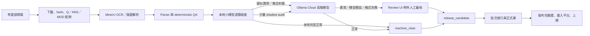

# 國考題蒐集、審核、整理、上線：決策型 TODO

更新日期：2026-07-27（Asia/Taipei）

## 這份清單怎麼用

本文件先做架構討論，不代表已授權實作。每個項目都用固定編號，後續可直接用編號逐項討論，例如「先討論 `REV-01`」。

- `[ ]`：尚未確認。
- `[x]`：已明確確認。
- `建議預設`：目前建議的起點，仍可修改。
- 所有 `P0` 決策確認後，才開始小批測試與正式實作。
- 大型正式資料不放進 Git；Git 只保存程式、schema、設定範例、文件與小型測試樣本。

## 已知前提

- [x] `BASE-01` 目前以醫學／locked-27 類科為新題優先範圍。
- [x] `BASE-02` 原始 PDF、測試資料、MinerU 與開發環境目前在本機。
- [x] `BASE-03` 人工審核權威目前是 Mac Studio 的 `http://192.168.10.70:8765/` 與其 PostgreSQL。
- [x] `BASE-04` 舊 20,000 份任務是獨立的歷史 backfill queue，可用 1 worker 接續；「20,000」是任務原始規模，不可當成目前剩餘數量。
- [x] `BASE-05` 長時間 MinerU 任務不設單份工作時限，使用 checkpoint、heartbeat 與可續跑設計，讓工作一路完成。
- [x] `BASE-06` 未來 AI MAX 395 到位後，預計搬移自動化、OCR、本地 LLM、PostgreSQL 與 Review UI。
- [x] `BASE-07` 目前階段只討論架構；架構逐項確認後，才進入測試與實作。

## 目標流程草案

建議分工：

- n8n：排程、手動觸發、狀態協調、通知；不承擔 OCR 或逐題推論本體。
- Python workers：掃描、下載、MinerU、parser、QA、匯入、匯出與驗證。
- PostgreSQL：工作狀態、候選題、模型稽核、人工事件與正式題庫的權威資料。
- 檔案／物件資產層：PDF、MinerU markdown、layout、圖片與發布包。
- 本地小模型：逐題檢查全部候選題。
- Ollama Cloud：處理本地疑點、無法判斷、模型衝突與少量 shadow audit。
- 人工：只處理真正例外、指定政策項目與批次上線授權。

---

## P0：先決治理與邊界

### 專案與資料權威

- [ ] `GOV-01` 確認 GitHub 的權威分支與合併方式。
  - 建議預設：`main` 保持可運行；架構與功能用 `codex/*` 分支及 PR 合併。
  - 驗收：本機、Mac Studio、未來 AI MAX 395 都能指出相同 commit SHA。

- [ ] `GOV-02` 統一本機與 Mac Studio 目前已漂移的程式碼。
  - 需列出兩邊未提交變更，決定哪一份是權威，不直接互相覆蓋。
  - 驗收：Review UI、schema、ingest scripts 只有一份正式版本。

- [ ] `GOV-03` 確認四種權威來源。
  - 官方真相：考選部頁面、PDF、ANS、MOD。
  - 工作流真相：PostgreSQL job state 與 artifact manifest。
  - 審核真相：append-only review events。
  - 正式題庫真相：formal tables 與已發布版本。

- [ ] `GOV-04` 定義環境：`dev`、`staging`、`production`。
  - 建議預設：本機可建 dev/staging；Mac Studio 暫為 production review authority。
  - 驗收：測試資料不可能誤寫正式審核事件或正式題庫。

### AI 與人工權限

- [ ] `GOV-05` 決定 AI 是否可以讓題目進入正式庫。
  - 現行 `AGENTS.md`：AI 只能 advisory，不可單憑 AI 自動 accept/block。
  - 建議第一階段：AI 產生 `machine_clear`，人工只做「批次放行」，系統再追加可追溯的人工作業事件。
  - 若要完全無人工批次放行，必須明確修改治理規則、正式表 promotion 條件與 rollback 規格。

- [ ] `GOV-06` 定義人工一定要看的政策清單。
  - 候選項：MOD、更正答案、多重答案、全部給分、答案缺失、申論題、新版型、圖片裁切失敗、官方 PDF 被替換、指定類科／年度。
  - 建議放在資料庫 `manual_review_rules`，不可散落在 prompt 或 n8n workflow。

- [ ] `GOV-07` 決定「抽樣」的三個概念是否保留。
  - 人工放行抽樣：成熟後可取消。
  - Cloud shadow audit：建議保留，用來發現本地模型的 false negative；不自動增加人工工作。
  - 人工品質稽核：只在模型、prompt、parser、MinerU 或官方版型變更時低頻啟用。

### 範圍與優先序

- [ ] `GOV-08` 定義醫學類科正式範圍與優先級。
  - 建議預設：locked-27 為 production；其他類科只能進獨立 backfill/staging。

- [ ] `GOV-09` 隔離舊 20,000 任務。
  - 1 worker、無工作時限、獨立 queue、獨立資源上限與 checkpoint。
  - 醫學新題到達時，必須能保留舊任務進度並調低資源，不能搶占 production pipeline。
  - 每次討論剩餘量前，以 live checkpoint／filesystem inventory 為準。

---

## P1：官方來源掃描與資產生命週期

### 掃描與差異判斷

- [ ] `SRC-01` 定義掃描觸發方式。
  - 建議預設：n8n 每日排程 + 手動按鈕共用同一個 workflow。
  - 手動 `scan-only` 不提交 checkpoint，正式 run 仍能看到同一批更新。

- [ ] `SRC-02` 定義「新題」與「官方更新」。
  - 不只比較 URL；必須保存下載時間、ETag／Last-Modified（若有）、bytes 與 SHA-256。
  - 相同 registry key 但 hash 改變時，建立 `source_refresh` 事件，不沿用舊的審核通過狀態。

- [ ] `SRC-03` 定義 Q／ANS／MOD 配對政策。
  - 建議預設：MOD 是目前正式答案，ANS 永久保留供追溯。
  - 缺答案不直接視為下載錯誤，需依題型與官方狀態分類。

- [ ] `SRC-04` 定義 stable ID 與去重規則。
  - 題目 ID 不依賴機器絕對路徑。
  - 補辦考試、同年多次考試、改名類科與重複上傳要能區分。

- [ ] `SRC-05` 定義網站結構改版偵測。
  - HTML selector、頁面欄位或 PDF 連結模式改變時停止 production ingest 並通知，不靜默產生空 catalog。

### 儲存與清理

- [ ] `STO-01` 定義資產目錄與 manifest。
  - PDF、MinerU raw、layout、markdown、圖片、candidate、發布包各自分層。
  - 資料庫只存 relative path、hash、provenance，不存機器絕對路徑。

- [ ] `STO-02` 定義每類資產的保存期限。
  - 永久：官方 PDF、hash manifest、正式審核事件、人工補圖、正式發布包。
  - 可重建：部分 cache、臨時 bundle、舊 parser 中間產物。
  - 可刪除前必須先證明有本地或備援副本。

- [ ] `STO-03` 定義 Mac Studio 最小保留集合。
  - 只保留 Review UI／PostgreSQL／人工審核所需 PDF、題圖、layout 與 manual assets。
  - 非引用 MinerU 備份、過時 bundle 與可重建 cache 由 retention job 清理。

- [ ] `STO-04` 定義 backup、restore 與災難復原。
  - PostgreSQL 定期 dump、資產 manifest、checksums、restore drill。
  - 驗收：在新機器可還原 Review UI，且 candidate、人工事件、manual assets 數量一致。

---

## P1：工作流、排程與可續跑

- [ ] `JOB-01` 決定控制平面。
  - 建議預設：先用 n8n；Dify 不進核心資料 pipeline。
  - Dify 只有未來需要可視化 prompt app／人工對話工具時再評估。

- [ ] `JOB-02` 定義唯一 job state machine。
  - 建議狀態：
    `discovered → downloaded → paired → ocr_done → parsed → rule_checked → llm_audited → routed → human_approved → formal → released`
  - 每一步保存 `started_at`、`heartbeat_at`、`finished_at`、attempt、worker、input/output hash 與錯誤分類。

- [ ] `JOB-03` 定義 idempotency。
  - 相同 input hash + parser/model/prompt version 不重做。
  - retry 只接續未完成 stage，不重複下載、不改寫人工事件、不重複 promotion。

- [ ] `JOB-04` 定義鎖與併發。
  - production scanner 同時只能一個。
  - MinerU、local LLM、cloud LLM 各有獨立 queue 與 concurrency。
  - 手動與排程同時觸發時，要回報「已有執行中」，不能開第二套流程。

- [ ] `JOB-05` 定義無時限任務的健康判斷。
  - 不設硬 timeout；改用 heartbeat、進度計數、GPU/CPU 使用、最後產物時間判斷 stalled。
  - stalled 只通知或安全重啟該 stage，不刪除已完成輸出。

- [ ] `JOB-06` 定義優先級與資源配額。
  - production 醫學新題 > production retry > cloud escalation > 舊 20,000 backfill。
  - AI MAX 395 上需為 MinerU、本地 LLM、PostgreSQL／UI 留出明確 CPU、RAM、VRAM 與磁碟水位。

- [ ] `JOB-07` 定義人工操作面。
  - n8n 提供：scan-only、完整處理、重試單一 run、暫停新取件、恢復 queue、查看狀態。
  - 不提供會清空 queue、刪除資產或重建正式庫的無確認按鈕。

---

## P1：MinerU、Parser 與 deterministic QA

- [ ] `OCR-01` 鎖定 MinerU 版本、模型與執行環境。
  - 每份輸出保存 MinerU version、command、host、開始／完成時間與 output hash。

- [ ] `OCR-02` 定義批次粒度。
  - 建議同考次／同類科批次載入模型；已完成 markdown 自動跳過。
  - 單份錯誤不可讓整批已完成結果失效。

- [ ] `OCR-03` 定義 OCR 完成條件。
  - 不只看資料夾存在；檢查必要 markdown、layout／content list、頁數與非空輸出。

- [ ] `PAR-01` 建立 parser 規則清冊與版本。
  - 題號、選項、題組、圖片、表格、跨頁、答案表、MOD 各有明確規則與 regression case。

- [ ] `PAR-02` 定義 deterministic QA。
  - 題號連續性、題數、選項數、重複題號、空題幹、異常字元、答案範圍、Q/ANS 數量差、資產遺失與 hash 不符。

- [ ] `PAR-03` 定義題組與圖題資料模型。
  - shared stem、question range、page/bbox、asset role、人工補圖與來源圖要可追溯。

- [ ] `PAR-04` 定義 parser 變更的審核失效規則。
  - 若改變已審 candidate 內容，必須 append `reset_review`，保留舊 note 與舊版本內容。

- [ ] `PAR-05` 定義哪些錯誤由規則直接修復。
  - 只允許可證明且可逆的 normalization。
  - 語意、科學符號、上下標、題組邊界等不可用模糊規則靜默改寫。

---

## P1：本地模型、Cloud escalation 與提示詞

- [ ] `LLM-01` 定義本地小模型逐題任務。
  - 建議檢查：OCR 截斷、題目／選項邊界、題組線索、疑似缺圖、異常字元、答案語意衝突、需要人工原因。
  - 輸出只描述觀察、證據與 route，不直接寫人工 accept/block。

- [ ] `LLM-02` 定義 Cloud escalation 條件。
  - 本地 `suspect`、`unable`、低信心、規則與模型衝突、需要視覺、輸出 schema 無效。

- [ ] `LLM-03` 定義 Cloud shadow audit。
  - 從本地 `clear` 中取少量且可調比例送 Cloud，不送人工。
  - 目的只為估計本地 false negative 與 drift。
  - 若 miss rate 超過門檻，暫停自動 machine-clear 並擴大檢查。

- [ ] `LLM-04` 建立 model registry，不在程式寫死模型名稱。
  - 欄位：provider、model ID、capabilities、vision、context、cost class、enabled、fallback、有效日期。
  - 視覺與純文字路由分開，模型上架／下架只改設定。

- [ ] `LLM-05` 建立 LLM gateway。
  - 統一本地 Ollama、Ollama Cloud 與未來 provider。
  - 自行做 JSON 擷取、schema validation、retry、fallback、rate limit、cache 與完整 provenance。
  - schema 多次無效時進例外，不猜測補值。

- [ ] `LLM-06` 建立 versioned prompt registry。
  - GPT-5.6-sol 負責設計重複性任務 prompt、JSON contract、issue taxonomy、gold cases 與修改建議。
  - production worker 只使用已核准的 prompt version，不臨時手動要求 AI。

- [ ] `LLM-07` 建立 gold set 與 eval。
  - 可從既有人工通過題目選取代表性樣本，需涵蓋一般題、題組、圖題、表格、科學符號、跨頁與 MOD。
  - 不只計 overall accuracy；需計 false negative、false positive、abstain、invalid JSON 與各 issue type recall。

- [ ] `LLM-08` 定義升級與回退門檻。
  - 換模型、prompt、量化、temperature 或 MinerU/parser 版本前先跑 eval。
  - 未達門檻不得取代 production version；可一鍵退回上一版。

- [ ] `LLM-09` 定義資料、成本與隱私。
  - Cloud 只送完成判斷所需的題文、選項、局部圖片與 provenance ID。
  - 不送 API key、本機路徑、資料庫密碼、未授權教材或整庫 dump。
  - 保存 token／成本、cache hit、model latency 與錯誤率。

---

## P1：人工審核與 Review UI 簡化

- [ ] `REV-01` 將 Review UI 主畫面改成 exception inbox。
  - 預設只顯示：模型衝突、Cloud 確認異常、無效輸出、政策強制、新版型、官方來源更新與需人工裁圖。
  - `machine_clear` 不要求逐題點擊。

- [ ] `REV-02` 定義人工最小動作。
  - 建議：確認正常、修正後通過、阻擋、需重新解析、延後／政策判斷。
  - 每個動作都 append event，保存 reviewer、時間、理由與當時 candidate/model/prompt version。

- [ ] `REV-03` 定義圖片審核。
  - 視覺模型先判斷需圖、錯圖、裁切或綁定疑點。
  - 人工只處理被確認的視覺異常與指定政策題；補圖保存 page/bbox/source hash。

- [ ] `REV-04` 定義批次 release approval。
  - 顯示本批題數、規則結果、模型版本、shadow 指標、人工例外處理完畢率與正式庫差異。
  - 一次核准整批，不逐題點擊正常題。

- [ ] `REV-05` 建立回饋閉環。
  - 人工修正轉成 issue taxonomy、gold case 或 deterministic rule 候選。
  - 不直接把人工 note 拼入 production prompt；先版本化、eval、核准。

- [ ] `REV-06` 定義待審優先排序。
  - 官方更正答案、資料缺失、題數不符、需視覺、模型衝突優先；低風險格式問題靠後。

---

## P1：本機到 Mac Studio Review DB 的對齊

- [ ] `SYNC-01` 確認遠端 schema version 與 migration 機制。
  - 每次同步前比對 schema；不允許兩台主機各自手改 production schema。

- [ ] `SYNC-02` 決定傳輸方式。
  - 建議預設：精準 artifact bundle + manifest + SHA-256，rsync 檔案；SQL 走明確 ingest CLI。
  - 不直接複製 PostgreSQL data directory。

- [ ] `SYNC-03` 定義 merge-only ingest。
  - 增量同步只 upsert 本次 candidate／index，不刪除其他類科 staging，不改寫 append-only review events。

- [ ] `SYNC-04` 定義同步前後稽核。
  - 先做 DB backup。
  - 比對檔案數與 hash、candidate/answer/AI/review event count、max event ID、run ID 與錯誤清單。

- [ ] `SYNC-05` 定義網路中斷續傳。
  - bundle 有固定 sync ID；重試同一 bundle，不重新掃描或重做 MinerU。

- [ ] `SYNC-06` 定義 conflict policy。
  - Mac Studio 的人工事件為權威；本機不得建立另一條 production 人工審核歷史。
  - 同 candidate key 內容不同時建立 source/parser revision，不用 last-write-wins。

---

## P1：正式入庫、發布與上線

- [ ] `REL-01` 定義 promotion gate。
  - 題目、答案、題組、圖片與政策狀態需同時滿足哪些條件，才能進 formal。
  - `machine_clear` 是否需要 `REV-04` 批次核准，由 `GOV-05` 決定。

- [ ] `REL-02` 定義正式資料不可變與修訂方式。
  - 已發布題目不原地靜默覆寫；使用 revision、superseded、release version 與 changelog。

- [ ] `REL-03` 定義發布前驗證。
  - foreign key、題數、答案、孤兒 asset、題組、hash、UTF-8、重複 stable ID、package schema、平台 dry-run。

- [ ] `REL-04` 定義發布包。
  - metadata-only、text-lite、full-official 與平台 import package 分開。
  - 每包保存 manifest、schema version、checksums、source commit、DB snapshot ID。

- [ ] `REL-05` 定義平台匯入。
  - 先 dry-run／staging，產生新增、更新、略過、衝突與刪除預覽。
  - production `--apply` 必須是獨立明確步驟，不由 OCR pipeline 直接觸發。

- [ ] `REL-06` 定義 rollback 與撤回。
  - 可依 release ID 回退平台資料；保留被撤回版本與原因，不刪除歷史稽核。

---

## P2：監控、安全與日常營運

- [ ] `OPS-01` 建立 dashboard。
  - 最新掃描、各 stage backlog、吞吐、stalled jobs、磁碟、DB、MinerU、local/cloud LLM、人工例外與 release 狀態。

- [ ] `OPS-02` 定義通知級別。
  - Info：發現新題、批次完成。
  - Warning：retry、shadow miss rate 上升、磁碟接近門檻。
  - Critical：來源改版、DB 同步衝突、正式驗證失敗、備份失敗。

- [ ] `OPS-03` 定義 audit log 與保留期。
  - n8n execution、worker log、model request metadata、review event、promotion 與 release 都能由 run ID 串起。

- [ ] `SEC-01` 統一 secrets 管理。
  - API key、DB password、SSH key 放 n8n credentials／環境 secret，不寫入 repo、workflow JSON、log 或 prompt。

- [ ] `SEC-02` 建立最小權限帳號。
  - scanner、worker、review UI、release importer 使用不同 DB role；AI worker 不得寫人工 review events。

- [ ] `SEC-03` 定義外部模型傳輸邊界與日誌去識別。

- [ ] `OPS-04` 撰寫 runbook。
  - 新題正常流程、MinerU 卡住、Cloud 失效、Mac Studio 離線、DB restore、模型 rollback、搬機與舊 queue 復原。

---

## P2：AI MAX 395 搬移

- [ ] `MIG-01` 將所有機器差異改成設定。
  - `TW_EXAM_REPO`、`ASSET_ROOT`、`MINERU_BIN`、DB、Review UI、Ollama endpoint 與 storage path 不寫死。

- [ ] `MIG-02` 建立服務部署清單。
  - n8n、PostgreSQL、Review UI、worker、MinerU、本地 Ollama、LLM gateway、backup、dashboard。

- [ ] `MIG-03` 建立容量與資源規劃。
  - CPU/RAM/VRAM、資料庫 IOPS、官方資產容量、備份空間、磁碟警戒與模型並發。

- [ ] `MIG-04` 建立搬移驗收。
  - restore DB、核對 assets hash、跑 scan-only、單一歷史樣本全流程、Review UI、模型 eval、發布 dry-run。

- [ ] `MIG-05` 定義切換與回退。
  - 切換期間只允許一個 production review authority。
  - AI MAX 395 驗收前，Mac Studio 保持可回退且不刪除必要資產。

---

## 架構確認後才開始的實作階段

- [ ] `IMP-00` P0 決策全部確認並凍結第一版 architecture decision records。
- [ ] `IMP-01` 先建立 job state、model/prompt registry、manual review rules 與 run ID 規格。
- [ ] `IMP-02` 用 1 個考次、1 個類科建立 isolated staging golden path。
- [ ] `IMP-03` 串接本地小模型逐題 audit，先只記錄、不影響 route。
- [ ] `IMP-04` 串接 Cloud escalation 與 shadow audit，驗證 schema、fallback、成本與 miss rate。
- [ ] `IMP-05` 將 Review UI 改成 exception inbox 與 batch release preview。
- [ ] `IMP-06` 測試本機 → Mac Studio bundle、merge-only ingest、backup、稽核與 retry。
- [ ] `IMP-07` 測試 formal promotion、package validation、平台 dry-run 與 rollback。
- [ ] `IMP-08` n8n 加入手動觸發；穩定後才啟用定期掃描。
- [ ] `IMP-09` 觀察一段期間後，才評估縮小人工批次核准或修改 `GOV-05`。
- [ ] `IMP-10` AI MAX 395 到位後依 migration acceptance checklist 搬移，不重寫核心 CLI。

## 建議逐項討論順序

1. `GOV-05`、`GOV-06`、`GOV-07`：AI、自動放行與人工責任邊界。
2. `REV-01`～`REV-04`：人工真正要看到什麼、按什麼。
3. `LLM-01`～`LLM-08`：本地／Cloud 路由、shadow audit、prompt 與 eval。
4. `JOB-01`～`JOB-07`：n8n、狀態機、無時限續跑與資源優先級。
5. `SYNC-01`～`SYNC-06`：本機與 Mac Studio 主庫如何安全對齊。
6. `REL-01`～`REL-06`：正式入庫、平台上線與 rollback。
7. `SRC-*`、`STO-*`、`OCR-*`、`PAR-*`：來源、資產、MinerU 與 parser 細節。
8. `OPS-*`、`SEC-*`、`MIG-*`：營運、安全與 AI MAX 395 搬移。
