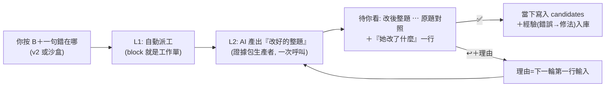

# 審修迴圈計畫書：你 block → AI 改 → 你看成品 → ✅ 即定稿

> 給下一個 session 的完整施工圖。開工前先讀「0. 已做」避免重作，「3. 鐵律」不可違反。
> owner 2026-10-03 定案的最終目標：**「我要看到異常的題目，AI 提出怎麼改，然後 AI 改了，
> 我點下去的當下她是真的已經被改過了；我同意就在 reviewUI 通過並成為經驗；不同意就依我的
> 指引重改。」**

---

## 0. 已做（2026-10-03，不要重作）

| 已存在 | 位置 | 證據 |
|---|---|---|
| 圖草案落地寫入器：`POST /api/figure/apply` | `repair_agent_test/agent/ui/server.py` `_apply_figure_drafts()`（含備份、manifest `store/figure_landing.jsonl`、append-only `reset_review`、**已 accept 題不動**） | q031 已落地：`candidates.jsonl` 該列 `image_refs` 帶 `q031_embedded-image.png`（source `figure_missing_second_pass`）；重打 apply 回「已寫入過」（冪等）；backup 在 `qbr/data/review-queues/live/backups/` |
| ✅ 即寫入：通過草案的當下套用 | 同檔 `figureVerdict()`：pass → `/api/judgement` → `/api/figure/apply` → 重載 | 前端 `index.html` `figureApply()` |
| 核圖模式（勾「圖草案待核」→ 收掉無關篩選＋PDF 面板）＋鍵盤 A（通過＋寫入）／X（退回，空理由拒絕） | `index.html` `syncFigdraftMode()`、keydown handler | |
| PDF 換題重載修掉（同一卷同頁不重設 src） | `index.html` `renderQuestion._pdfShown` | 量測依據：後端各端點 <0.5s，慢在前端 PDF iframe 重解析 |
| sandbox UI 伺服器 | 執行中：`cd repair_agent_test/agent && python3 ui/server.py --port 8790 --host 0.0.0.0`（服務名 figserver2）；Tailscale `http://100.96.207.80:8790/` | `/api/figure` count=634 |

## 1. 目標流程（一個迴圈，四個狀態）

狀態只有四個：`待AI → 待你看 → 定稿`（退回中＝待AI）。**沒有**第二層「寫入與否」。

## 2. 現有積木（直接用，不重寫）

| 積木 | 位置 | 契約 |
|---|---|---|
| block 事件（append-only） | `qbr/data/review-queues/live/review-ui/question_review_events.jsonl`（本機快照；站上是家，`sync_from_station.sh` 撈回） | 人的列 `reviewer: local`；機器列前綴見 `REPAIR_REVIEWER_PREFIXES`（qbr.review_ui.constants） |
| AI 草案寫入 | `repair_agent_test/agent/bridge.py` `propose` 子命令 → `store/repair_drafts.jsonl`（schema `repair_agent_test/repair_drafts v1`；`fix`＝**改完後的完整文字**、`insert`＝落點欄位、`basis`、`crop`+sha256、`status: proposed`） | 機器永不寫人審帳本 |
| 草案讀取＋行 SHA | `ui/server.py` `drafts_for`→`_sha256`（整行 sha256，裁決事件以它指涉） | |
| ✅ 人工核准寫帳本 | `ui/server.py` `append_accept()`：只從設計者點擊可達；`source: sandbox_accept`；事件帶 `repair_draft_sha256` | 已存在，沿用 |
| ↩ 退回＋理由（必填） | `ui/server.py` `append_return()` → 學習檔 `action: repair_return` | 空理由 400 |
| 改後整題即時預覽 | `index.html` `appliedQuestion()`（fix 整句替換、平台渲染 `_fix_html`） | 已存在 |
| 經驗庫 | `store/lessons.jsonl`（`remember()` in `lib/identity.mjs`；`remember_lesson` tool；累計不重複） | 生產者 prompt 先讀 |
| 證據包生產者形態（100x 的那一個） | `qbr/scripts/figure_missing_second_pass.py`：一列一次呼叫＝題面＋refs 現況＋裁片清單＋裁片影像 → decision/refs/where/basis；refs⊆磁碟由 runner 重驗；degraded 不硬湊 | 修題文字也走這形態，**不走** agent-session 徘徊（9.4分/題 已證不可用） |
| 做事模型 lane | `engines.py`（occamy＝做事；`CONDUCTOR_MODEL`=GLM 只給對話子進程；pin 不符拒跑） | 10-03 owner 裁決不變 |
| 圖草案（634） | `store/scans/20261001-figure-producer/figure_drafts_run{A,B}.jsonl`；A/B 共識 1.0 | 已是「待你看」存量，併入 L3 清單 |

## 3. 鐵律（違反任何一條就不出貨）

1. **人工事件 append-only**：AI/落地只能 append `reset_review`（reviewer 帶機器前綴），永不改寫、永不冒充 `local`。
2. **✅ 的當下＝已寫入**：UI 不準出現「判通了還要再按寫入」的兩段式。
3. **寫入必先備份＋manifest**（`store/*_landing.jsonl` 記 before/after sha256、backup 路徑）；`image_refs`/文字欄**只增不刪**，修文字以「整欄替換為 fix」為單位但原值保留在 reset_review 事件的 `changes[].from`。
4. **你 accept 過的題不動**（除非你指名）——已實作在 `_apply_figure_drafts` 的 `_human_landing_states`，文字落地沿用同一個 fold。
5. **生產者只引用真實存在的證據**（裁片必須存在於 QUEUE_ROOT；虛構即 degraded 不產出）。
6. **本機佇列為寫入目標**；站上同步一律 `deploy_station.sh --restart` 且逐批 owner 核准（G3 邊界不變）。**G3 從此＝你按下的 ✅/寫入鈕本身，不是會議。**

## 4. 缺的三根線（施工項）

### L1｜block → 自動派工（`repair_agent_test/agent/dispatch.mjs`，新檔）

- **輸入**：`HUMAN_EVENTS`（本機快照）＋ cursor `store/dispatch_cursor.json`（存 offset/mtime，崩潰安全）。
- **行為**：新的人類 `block`（且該題沒有「晚於它的未結草案」）→ 寫一列到 `store/workorders/wo-repair.jsonl`：
  `{key, human_block_reason, return_reasons:[...學習檔該題所有 repair_return 的 reason,依時序], lessons:[該科目 top], crop:<紙本裁片路徑>, fields:[block 理由推斷的目標欄位,預設 stem]}` → 呼叫做事模型（見 L2）→ 產出 `propose` 草案 → 狀態變「待你看」。**不寫 candidates、不碰人審帳本。**
- **跑法**：手動 `node dispatch.mjs --once`（先）／`--watch 60`（之後）。**不接常駐機**；本機沙盒內閉環。
- **負對照**：機器列的 block（`repair_*` 前綴 reviewer）不得觸發派工；沒有 block 理由也要能派工（reason 空）。
- **驗收**：`--once` 對一筆已知 block 產出 wo 列＋草案一筆（status proposed）；重跑 cursor 不重派。

### L2｜修題生產者（`qbr/scripts/repair_second_pass.py`，新檔；形態複製 `figure_missing_second_pass.py`）

- **一次呼叫**：題面＋`image_refs` 現況＋紙本裁片影像＋**你的 block 理由（第一行）**＋**歷次 ↩ 理由（依序）**＋該科目經驗 top-N → 輸出 `{fix(整欄完整文字), insert(欄位), basis(紙本依據), crop(看過的裁片)}` → 直接走 bridge `propose`（帶 crop sha256）。
- **溫度 0、pin 核對、答不可用即 degraded 不硬湊**（沿用既有防呆）；一題一輪 ≈ 秒級（A/B 輪可選，先單輪＋你審）。
- **負對照**：refs/fix 引用不存在裁片 → degraded；prompt 不含 block/return 理由時測試失敗。
- **驗收**：對今天 q031 同型題（缺圖）＋一題文字 block 各跑一輪，草案欄位完整、`basis` 指到真實紙本字。

### L3｜「待你看」單一清單（`ui/server.py`＋`index.html`）

- **後端**：新增 `GET /api/pending`＝（a）`repair_drafts` 中 status=proposed 且晚於該題任何人類 accept/return 的題（帶 `_sha256`、改後整題欄位）；＋（b）圖草案 ruling=pass 未 landed 的題；＋（c）圖草案未判的題。**一個數字回答「現在積幾題等我」。**
- **前端**：`?mode=review`（或按鈕「待你看 (N)」）→ 左欄只剩 pending 清單（依最舊優先）；中欄**直接是改後整題**（`appliedQuestion` 已做）＋「對照原版」切換＋「她改了什麼」一行（`insert`＋basis 摘要）；✅/↩ 在列上（既有）。
- **✅ 的語意（新）**：文字草案 ✅＝`append_accept`（既有，帶 draft_sha）＋**`_apply_text_drafts(keys)`**（新，複製 `_apply_figure_drafts` 骨架：備份→逐列以 `fix` 整欄替換 `insert` 指的欄位→append-only `reset_review`（若曾被審過）→manifest）＋**經驗入庫**：`lessons.jsonl` 追加 `{kind, subject, text:"錯誤：<block理由> → 修法：<fix 摘要>", key}`（由該題 block 理由＋草案組成，actor `human:designer`）。
- **↩ 的語意（既有＋一根管）**：`append_return` 存理由（必填）→ L1/L2 下一輪把它放 prompt 第一行。**同一題退回第 3 次起，清單該列標「反覆退回」提示升級處理（問你或換策略），不是無限迴圈。**
- **負對照**：無 `_sha256` 的 ✅ 拒絕；fix 為空/等於原值拒絕；`insert` 指向不存在欄位拒絕；`_apply_text_drafts` 對未 ✅ 的 key 拒絕。
- **驗收**：`run_tests.sh` 全綠＋手動一圈：block 一題 → dispatch → pending+1 → ✅ → v2（本機 8765 mirror 或站上同步後）該題顯示改後文字、`question_review_events` 多一筆 `reset_review`（機器前綴）、`lessons.jsonl` 多一筆、manifest 記錄在案。

## 5. 資料流與寫者一覽（誰能寫什麼）

| 檔 | 寫者 | 讀者 |
|---|---|---|
| `question_review_events.jsonl` | 你（v2）、落地寫入器（僅 `reset_review`，機器前綴） | dispatch、UI、v2 |
| `store/repair_drafts.jsonl` | bridge `propose`（AI 生產者） | UI pending、`append_accept` |
| `store/agent_feedback.jsonl` | `/api/judgement`（你＋AI，engine 標明） | UI、L1/L2 |
| `store/lessons.jsonl` | ✅ hook、`remember_lesson` | 生產者 prompt |
| `candidates.jsonl`（本機） | `_apply_{figure,text}_drafts`（唯一寫入口，備份+manifest） | v2、UI |
| `store/figure_landing.jsonl` / `store/text_landing.jsonl` | 對應 apply | 稽核 |

## 6. 施工順序（每步可獨立驗收，做完一步 commit 一步）

1. **L3 後端** `_apply_text_drafts`＋`/api/pending`（先做，因為它是 ✅ 的落點；負對照測試齊）。
2. **L3 前端** 待你看模式（改後整題＋✅/↩＋對照）。
3. **L2** 生產者＋單題試跑（你 block 的真題 2–3 題）。
4. **L1** dispatch `--once` 接上 2/3，跑完整圈；最後才做 `--watch`。
5. **634 圖草案併入 pending**（存量清單），你逐批 ✅（每批 50，`figureApply` 已可整批呼叫）。
6. **站上同步**：等你點頭的批次，`deploy_station.sh --restart`；同步前站上服務暫停（`review_record_safety.md` 規則）。

## 7. 風險與已知坑（先讀再動工）

- **服務開著改 candidates 會短暫不一致**（`qbr/reports/review_record_safety.md`）：apply 前 UI 已在跑——先量：apply 前後 server 對同一 key 的 view 是否一致；必要時 apply 內短暂持鎖＋UI 提示「重整」。**不要**在站上服務活著時對站上佇列落地。
- `repair_daemon.sh` 的 `busy()` 定義問題（§3.9 repair-open-items）——本計畫**不用**那支 daemon，沙盒內新起 `dispatch.mjs`，別接舊迴圈。
- gh token 曾被寫成空殼：PR 前 `stat ~/.config/gh/hosts.yml`。
- 生產者 pin 不符要拒跑（`engines.py` probe）；occamy KV 現值 65536 對單題呼叫夠用。
- **每個 check 帶負對照**（repo 規則）；測試放 `repair_agent_test/agent/`（mjs）或 `qbr/tests/`（py）。

## 8. 一圈驗收劇本（最終 gate）

你 block「moex:…:qNNN 題幹第 3 行錯字」→ `dispatch --once` → AI 產草案（basis 指到紙本）→ 你開 `?mode=review` 看到**改後整題**→ ✅ → 立刻：candidates 該欄＝fix、events 多 reset_review、lessons 多一筆、pending−1、v2 重整可見。↩ 路徑：你給理由 → 下一輪 prompt 第一行就是它 → 新草案。**兩條都通，機制成立。**
